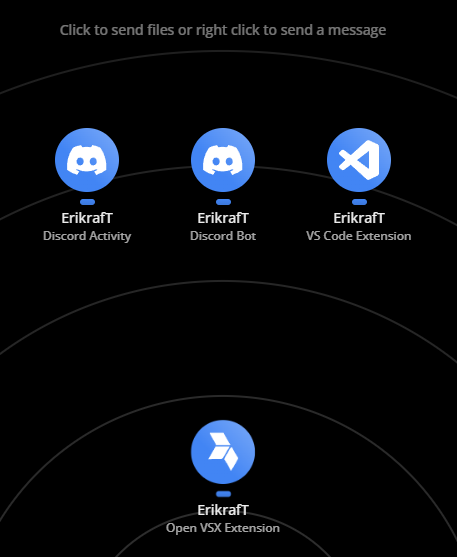

# Partnership Request Guidelines

(OFFICIAL "client")

 
 

Partner up by creating an [Issue](https://github.com/erikraft/Drop/issues) in this repository so I can review and decide whether to accept the partnership to have a PARTNER ("client"). In the Issue description, clearly outline:

- A concise summary of your organization or project.
- How this partnership will help Drop and why it is valuable for both sides.
- The main goals you expect the partnership to achieve.
- The target audience and communities that will benefit.
- Any specific support, assets, or timelines required from Drop.

## Logo Submission Requirements

- A photo of the logo is mandatory.
- Accepted formats: `.png`, `.jpg`, `.jpeg`, and similar.
- Preferred format: `.svg`.
- If the logo is submitted in `.png`, `.jpg`, `.jpeg`, or similar formats, it will be converted to `.svg`.
- Submit the logo in an all-white version.
- We strongly recommend providing the `.svg` version.
- Include a white `.svg` version sized at 40x40.
