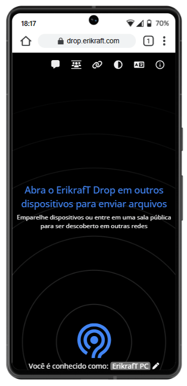
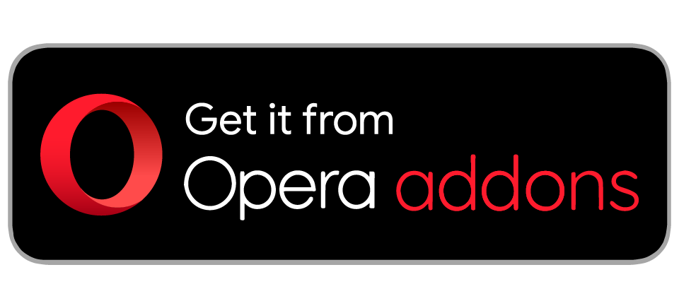

<div align="center">
  <a href="https://github.com/erikraft/Drop">
    
  </a>

  <h1><em>Send it</em>, with <a href="https://drop.erikraft.com/">ErikrafT Drop™</a></h1>

  <p>
    Local file sharing <a href="https://drop.erikraft.com/">  <strong>in your web browser</strong></a>.<br>
    Inspired by Apple's AirDrop and <a href="https://github.com/schlagmichdoch/PairDrop">Schlagmichdoch's PairDrop</a>.<br>
    Fork of <a href="https://github.com/schlagmichdoch/PairDrop">PairDrop</a>.
  </p>

[](https://docsdrop.erikraft.com/)&nbsp;
[](https://www.instagram.com/erikraft_drop)&nbsp;
[](https://www.threads.com/@erikraft_drop)&nbsp;
[](https://linkedin.com/company/erikraft-drop)&nbsp;
[](https://deepwiki.com/erikraft/Drop)&nbsp;
[](https://crowdin.com/project/erikraft-drop)&nbsp;
&nbsp;

[🤝🏻 Form a Partnership](PARTNERSHIP.md)

<br>

  <p>
     <a href="https://github.com/erikraft/Drop/issues">Report a bug</a><br />
     <a href="https://github.com/erikraft/Drop/issues">Request feature</a>
  </p>
</div>

<br>

<p align="center">
  Minecraft Community<br>
  <a href="https://discord.gg/8ErMwRy4aj"></a>
  &nbsp;
<br>
<br>
<br>
ErikrafT Drop™ Community
<br>
  <a href="https://discord.gg/KWvqwRxjnA"></a>
  &nbsp;
<br>

</p>

<br>

---

## 🌐 ErikrafT Drop™ Instances

- [https://drop.erikraft.com](https://drop.erikraft.com)
- [https://drop-fallback.erikraft.com](https://drop-fallback.erikraft.com)
- [https://dropfallback.erikraft.com](https://dropfallback.erikraft.com)

---

🔮｜See possible old or future files that have not yet been released in the source code on Github or that have already been released in the past, which is on my computer in a 2nd public folder here on Mega  [CLICK HERE](https://mega.nz/folder/kgJj2DTQ#uov-pmvrn3ebMdQkLvtdPQ)

---

<br>

｜ErikrafT Drop™ Available for Android: [CLICK HERE](https://github.com/erikraft/Drop-Android)

<br>

## ⚙️ Features
File sharing on your local network that works on all platforms.

<br>

- Desktop Applications

  - Linux (.deb)
    - https://github.com/erikraft/Drop/releases/latest/download/erikraft-drop-linux-amd64.deb

- **Extensions**
  - [VS Code Marketplace](https://marketplace.visualstudio.com/items?itemName=ErikrafT.erikraft-drop)
  - [Open VSX Registry](https://open-vsx.org/extension/ErikrafT/erikraft-drop)
  - [Opera Add-ons](https://addons.opera.com/en/extensions/details/erikraft-drop/)
  - [Thunderbird Add-ons](https://addons.thunderbird.net/pt-BR/thunderbird/addon/erikraft-drop/)
  - [Firefox Browser Add-ons](https://addons.mozilla.org/pt-BR/firefox/addon/erikraft-drop/)

- **A multi-platform AirDrop-like solution that works.**
  - Send images, documents or text via peer-to-peer connection to devices on the same local network.
- **Internet transfers**
  - Join temporary public rooms to transfer files easily over the Internet.
- **Web-app**
  - Works on all devices with a modern web-browser.
- **Discord integrations**
  - Send files directly from Discord using the example bot located at [`Discord/Bot`](Discord/Bot/README.md). The device appears on the website with a Discord icon, and transfers occur in real time using the official WebSocket fallback.
  - Publish a custom activity from [`Discord/Activities`](Discord/Atividades/README.md) to embed ErikrafT Drop™ directly inside Discord with automatic device identification.

- **iOS Share Menu integration**
  - Send images, files, folders, URLs, or text directly from the iOS share menu using a custom Shortcut.

  **Download the shortcut:**
  - https://routinehub.co/shortcut/24753/
  - https://www.icloud.com/shortcuts/f81dbac00823445e8feefd0f834b40e7
  - https://github.com/erikraft/Drop/raw/refs/heads/master/Shortcut/ErikrafT%20Drop.shortcut

Send a file from your phone to your laptop?
<br>Share photos in original quality with friends using Android and iOS?
<br>Share private files peer-to-peer between Linux systems?

<br>


---

## 🌍 Help with Translation

Want to help make ErikrafT Drop™ available in more languages? You can contribute to the translation efforts at:

**https://crowdin.com/project/erikraft-drop**

Join our community of translators and help bring ErikrafT Drop™ to users around the world!

---

## 🔀 Differences to the [Snapdrop](https://github.com/RobinLinus/snapdrop) it is based on
<details><summary>👀｜View all differences</summary>

> **Scope:** This section describes the historical/architectural differences inherited by ErikrafT Drop™ from the PairDrop base relative to Snapdrop. It is **not** the list of differences between ErikrafT Drop™ and PairDrop.

### 📶 Paired Devices and Public Rooms — Internet Transfer
* Transfer files over the Internet between paired devices or by entering temporary public rooms.
* Connect to devices in complex network environments (public Wi-Fi, company network, iCloud Private Relay, VPN, etc.).
* Connect to devices on your mobile hotspot.
* Devices outside of your local network that are behind a NAT are auto-connected via the ErikrafT Drop™ TURN server.
* Devices from the local network, in the same public room, or previously paired are shown.

#### 🔐 Persistent Device Pairing

Always connect to known devices

* Pair devices via a 6-digit code or a QR-Code.
* Paired devices always find each other via shared secrets independently of their local network.
* Pairing is persistent. You find your devices even after reopening ErikrafT Drop™.
* You can edit and unpair devices easily.

#### 🌎 Temporary Public Rooms

Connect to others in complex network situations, or over the Internet.

* Enter a public room via a 5-letter code or a QR-code.
* Enter a public room to temporarily connect to devices outside your local network.
* All devices in the same public room see each other.
* Public rooms are temporary. Closing ErikrafT Drop™ leaves all rooms.

### ✨ [Improved UI for Sending/Receiving Files](https://github.com/RobinLinus/snapdrop/issues/560)
* Files are transferred after a request is accepted. Files are auto-downloaded upon completing a transfer, if possible.
* Multiple files are downloaded as a ZIP file
* Download, share or save to gallery via the "Share" menu on Android and iOS.
* Multiple files are transferred at once with an overall progress indicator.

### 💬 Send Files or Text Directly From Share Menu, Context Menu or CLI
* [Send files directly from context menu on Ubuntu (using Nautilus)](docs/how-to.md#send-multiple-files-and-directories-directly-from-context-menu-on-ubuntu-using-nautilus)
* [Send files directly from the context menu on Windows](docs/how-to.md#send-multiple-files-and-directories-directly-from-context-menu-on-windows)
* [Send directly from the "Share" menu on iOS](docs/how-to.md#send-directly-from-the-share-menu-on-ios)
* [Send directly from the "Share" menu on Android](docs/how-to.md#send-directly-from-the-share-menu-on-android)
* [Send directly via the command-line interface](docs/how-to.md#send-directly-via-command-line-interface)

### 🌱 ErikrafT Drop™ Features & Improvements

The old PairDrop list has intentionally been removed from this section. Features such as display-name changes, paste/send flow improvements, wake-lock behavior, multi-tab support, media previews, Node-only operation, auto-restart, general stability fixes, local-network discovery, custom STUN/TURN configuration, and translations are not automatically ErikrafT Drop™-specific simply because they are present in the current fork.

Historical PairDrop contributors remain credited by the upstream PairDrop project and history. They are not presented here as contributors to ErikrafT Drop™-specific work.

</details>

---

## 🧬 Project Origin and Base

ErikrafT Drop™ is a **fork of PairDrop**. PairDrop itself is a **fork of Snapdrop**. The relationship is:

```text
Snapdrop
   ↓
PairDrop
   ↓
ErikrafT Drop™
```

The **Differences to Snapdrop** section above explains changes introduced by PairDrop relative to Snapdrop. It should not be interpreted as a list of ErikrafT Drop™-specific features.

ErikrafT Drop™ extends and adapts the PairDrop foundation with additional code, integrations, documentation, branding, and transfer modes developed for the ErikrafT ecosystem.

## ✨ What makes ErikrafT Drop™ different from PairDrop?

This section lists only differences identifiable in the current ErikrafT Drop™ repository or its pinned Android submodule. Shared PairDrop functionality is intentionally excluded.

### 📡 ERIKRAFT-QR Animated Optical Transfer

ErikrafT Drop™ contains an implemented animated QR transfer engine in `public/scripts/erikraft-qr.js` and associated UI/control code.

- Transfers **files or text** as a sequence of animated QR frames.
- The transfer is designed to work without WebRTC, WebSockets, or network connectivity once the application is loaded.
- Frames use the `EKQR` protocol header and contain transfer metadata, chunk indexes, Base64 payload data, CRC32 checksums, and a final SHA-256 digest.
- The current implementation uses **XOR-based parity recovery**, not a general Fountain/Luby Transform implementation. Parity frames combine pairs of base chunks and can recover one missing chunk when the corresponding other chunk and parity frame are available.
- The receiver accepts duplicate and out-of-order frames and performs CRC32 validation before storing payload data.
- Completed transfers are reassembled and verified with SHA-256 before being delivered to the user.

See [`ERIKRAFT-QR.md`](ERIKRAFT-QR.md) for the protocol documentation.

### 📷 QR Scanner as a Separate Feature

ErikrafT Drop™ also has an ecosystem QR scanner. It is separate from Animated QR Transfer:

- **QR Scanner:** scans static QR codes/URLs and can recognize ErikrafT ecosystem links and pairing/room URLs.
- **Animated QR Transfer:** continuously renders or captures a stream of QR frames carrying file/text payload data.

These two functions must not be documented as the same feature.

### 📴 Offline Optical Transfer and PWA Integration

The service worker precaches the QR transfer code, scanner dependencies, localization assets, and other client-shell resources. The Animated QR system is designed to continue after the application has been loaded, without network requests during the optical transfer itself.

This should **not** be described as "all ErikrafT Drop™ file transfer works offline". Normal WebRTC/WebSocket transfers still depend on their networking/signaling environment.

### 🌐 ErikrafT-Specific Ecosystem Integrations

The repository contains integrations that are not part of the standard PairDrop README feature set, including:

- Discord bot integration and a Discord Activity for launching/using ErikrafT Drop™.
- iOS Share Menu integration through a dedicated Shortcut.
- Browser extensions and IDE integrations maintained under `Extensions/`.
- A dedicated command-line client under `erikraftdrop-cli/`.
- An Android application maintained as the `Android/` submodule.
- ErikrafT-specific branding, logos, domains, UI assets, and documentation.

These are ecosystem integrations, not claims that the underlying PairDrop transfer protocol was replaced.

### 🧪 WebTorrent Transfer — Beta

The repository also contains an explicitly documented **WebTorrent transfer mode**. It is experimental/beta and uses magnet-based peer discovery and WebRTC between compatible peers. It should therefore be described as a beta transfer option rather than as the normal ErikrafT Drop™ transfer mechanism.

See [`docs/features/webtorrent-beta.md`](docs/features/webtorrent-beta.md).

## 🔗 Shared and Inherited Features

The following should be understood as part of the PairDrop/Snapdrop-derived foundation rather than as ErikrafT Drop™-exclusive functionality unless the ErikrafT Drop™ implementation has been materially changed:

- WebRTC/WebSocket-based peer-to-peer transfers.
- Local-network device discovery.
- Persistent device pairing and temporary public rooms.
- Six-digit pairing keys and QR-based pairing links.
- ZIP downloads for multiple files.
- Wake-lock/display-sleep prevention during transfers.
- Theme and display-name behavior inherited or adapted from the upstream client.
- Configurable STUN/TURN infrastructure for self-hosted deployments.
- General browser-based file/text transfer behavior.

The purpose of this section is to prevent shared upstream capabilities from being mistaken for unique ErikrafT Drop™ inventions.

## 📊 Feature Comparison

> **About Snapdrop's current status:** The original Snapdrop project was acquired by LimeWire. The `SnapDrop/snapdrop` repository remains available as the classic open-source implementation and can still be self-hosted. The repository continues to contain the original WebRTC, WebSocket signaling, and PWA implementation. However, the current public `snapdrop.net` service is no longer equivalent to the classic self-hosted implementation. The comparison below therefore distinguishes the classic open-source repository from the current public service where relevant.
>
> The following comparison is intentionally conservative. `✓` means the feature is present in the referenced project or implementation; `—` means it was not identified as a documented/core feature of that project; `✕` means the feature was removed; `✕*` means the feature existed in the original Snapdrop implementation but is no longer provided by the current public Snapdrop/LimeWire service; `✓*` means the feature remains present in the classic open-source repository, but its availability in the current public service may differ; `Experimental` means the feature exists but is explicitly beta/experimental.

| Feature | [Snapdrop](https://github.com/SnapDrop/snapdrop) | [PairDrop](https://github.com/schlagmichdoch/PairDrop) | [ErikrafT Drop™](https://github.com/erikraft/Drop) |
|---|---:|---:|---:|
| WebRTC transfer | ✕* | ✓ | ✓ |
| WebSocket signaling | ✕* | ✓ | ✓ |
| PWA | ✓* | ✓ | ✓ |
| Persistent device pairing | — | ✓ | ✓ |
| Temporary public rooms | — | ✓ | ✓ |
| Static QR pairing/scanning | — | ✓ | ✓ |
| Animated QR optical file/text transfer | — | — | ✓ |
| XOR-based QR parity recovery | — | — | ✓ |
| Offline optical transfer | — | — | ✓ |
| Android integration | — | [✓](https://github.com/fm-sys/pairdrop-android) | [✓](https://github.com/erikraft/Drop-Android) |
| Discord integration | — | — | ✓ |
| iOS Share Menu integration | — | ✓ | ✓ |
| WebTorrent transfer | — | — | Experimental |
| ErikrafT-specific branding/ecosystem | — | — | ✓ |

> **Snapdrop notation:** `✕*` for WebRTC and WebSocket signaling refers to the current public Snapdrop/LimeWire service, not the classic `SnapDrop/snapdrop` repository. The classic repository still contains the original WebRTC/WebSocket implementation. `✓*` for PWA indicates that the PWA implementation remains present in the classic open-source repository; this does not necessarily represent the behavior or availability of the current public service.

> This table does not claim that every implementation detail is absent from upstream projects. It distinguishes the documented/core capabilities relevant to this repository from the ErikrafT Drop™-specific additions.

## 🌍 Internationalization

ErikrafT Drop™ maintains a localization system using locale JSON files under `public/lang/`, with English and Brazilian Portuguese among the maintained locale files. The application also contains localization-specific client code and a Crowdin integration for translation work.

Translation coverage can vary by locale and should not be interpreted as every string being equally translated in every language.

## 👥 Upstream Attribution

ErikrafT Drop™ preserves the project's PairDrop/Snapdrop lineage and the existing license/attribution files. Contributors credited by PairDrop for upstream features are not reclassified as contributors to ErikrafT Drop™-specific changes by this documentation update.

The `LICENSE` file and third-party license files remain part of the repository and are not removed by this documentation change.

---

## 🔨 Built with the following awesome technologies:
* Vanilla HTML5 / JS ES6 / CSS 3 frontend
* [WebRTC](http://webrtc.org/) / WebSockets
* [Node.js](https://nodejs.org/en/) backend
* [Progressive web app (PWA)](https://en.wikipedia.org/wiki/Progressive_web_app) unified functionality
* [IndexedDB API](https://developer.mozilla.org/en-US/docs/Web/API/IndexedDB_API) storage handling
* [zip.js](https://gildas-lormeau.github.io/zip.js/) library
* [cyrb53](https://github.com/bryc/code/blob/master/jshash/experimental/cyrb53.js) super-fast hash function
* [NoSleep](https://github.com/richtr/NoSleep.js) display sleep, add wake lock ([MIT licenses/MIT-NoSleep])
* [heic2any](https://github.com/alexcorvi/heic2any) HEIC/HEIF to PNG/GIF/JPEG ([MIT licenses/MIT-heic2any])
* [Crowdin](https://crowdin.com/) web-based localization tool
* [BrowserStack](https://www.browserstack.com/) This project is tested with BrowserStack

[❓｜FAQ](docs/faq.md)

[📡｜Host your own instance with Docker or Node.js](docs/host-your-own.md).

---

## ⏬ Getting ErikrafT Drop™

<div align="center" style="display: inline_block; gap: 10px;"><br>
  <a href="https://drop.erikraft.com/" target="_blank">
    
  </a>
<a href="https://github.com/erikraft/Drop/releases/latest/download/erikraft-drop-linux-amd64.deb" target="_blank">
  
</a>
<a href="https://github.com/erikraft/Drop/releases/latest/download/erikraft-drop-10.1.3-win-x64.exe" target="_blank">
  
</a>
  <a href="https://play.google.com/store/apps/details?id=com.erikraft.drop" target="_blank">
    
  </a>
  <a href="https://f-droid.org/en/packages/com.erikraft.drop/" target="_blank">
    
  </a>
  <a href="https://apkpure.com/p/com.erikraft.drop" target="_blank">
    
  </a>
  <a href="https://github.com/erikraft/Drop-Android/releases/latest/download/Drop-Android.apk" target="_blank">
    
  </a>
  <a href="https://routinehub.co/shortcut/24753/" target="_blank">
    
  </a>
  <a href="https://discord.com/oauth2/authorize?client_id=1367869058707492955" target="_blank">
    
  </a>
  <a href="https://marketplace.visualstudio.com/items?itemName=ErikrafT.erikraft-drop" target="_blank">
    
  </a>
  <a href="https://open-vsx.org/extension/ErikrafT/erikraft-drop" target="_blank">
    
  </a>
  <a href="https://addons.opera.com/en/extensions/details/erikraft-drop/" target="_blank">
    
  </a>
  <a href="https://addons.thunderbird.net/pt-BR/thunderbird/addon/erikraft-drop/" target="_blank">
    
  </a>
  <a href="https://addons.mozilla.org/pt-BR/firefox/addon/erikraft-drop/" target="_blank">
    
  </a>
</div>

---

## 🌐 Links

[｜biodrop.erikraft.com](https://biodrop.erikraft.com/)
<br />
[｜drop.erikraft.com](https://drop.erikraft.com/)
<br />
[✍🏻｜Documentation](https://docsdrop.erikraft.com/)
<br />
[🛡️｜Privacy Policy](https://drop.erikraft.com/privacy-policy.html)
<br />
[🛡️｜Terms of Use](https://drop.erikraft.com/terms-of-use.html)
<br />
[🛡️｜License](https://github.com/erikraft/Drop/blob/master/LICENSE)
<br />
[🛡️｜Security](https://github.com/erikraft/Drop/blob/master/SECURITY.md)
<br />
[｜ErikrafT Drop™ Android Github Repository](https://github.com/erikraft/Drop-Android)
<br />

---

## 💰 Support
<a href="https://ko-fi.com/erikraft" target="_blank">

</a>
<br />
<br />

ErikrafT Drop™ is libre, and always will be. \
If you find it useful and want to support free and open-source software, please consider donating using the button above. \
I footed the bill for the domain and the server, and you can help create and maintain great software by supporting me. \
Thank you very much for your contribution!

---

## 🙏 Thank you everyone's support :)

<a href="https://www.star-history.com/#erikraft/Drop&Date">
 <picture>
   <source media="(prefers-color-scheme: dark)" srcset="https://api.star-history.com/svg?repos=erikraft/Drop&type=Date&theme=dark" />
   <source media="(prefers-color-scheme: light)" srcset="https://api.star-history.com/svg?repos=erikraft/Drop&type=Date" />
   
 </picture>
</a>
