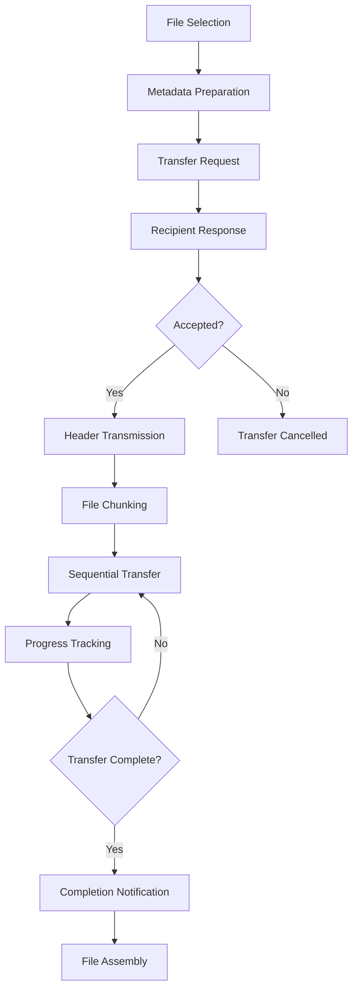

# File Transfer Flow

ErikrafT Drop implements a sophisticated file transfer system that handles everything from small text messages to large multi-gigabyte files. The system uses WebRTC DataChannels for direct peer-to-peer transfers with WebSocket fallback when necessary.

## Transfer Lifecycle Overview



## File Selection and Metadata

### File Processing
```javascript
// From network.js lines 675-702
async requestFileTransfer(files) {
    let header = [];
    let totalSize = 0;
    let imagesOnly = true;

    for (let i = 0; i < files.length; i++) {
        const file = files[i];
        const fileHeader = {
            name: file.name,
            size: file.size,
            mime: file.type || mime.defaultMime
        };

        header.push(fileHeader);
        totalSize += file.size;

        if (!mime.isImage(file)) {
            imagesOnly = false;
        }
    }

    this._filesRequested = files;
    this.sendJSON({
        type: 'request',
        header: header,
        totalSize: totalSize,
        imagesOnly: imagesOnly
    });
}
```

### MIME Type Detection
The system automatically detects and adds missing MIME types:

```javascript
// From network.js line 1464
let files = mime.addMissingMimeTypesToFiles([...message.files]);
```

## Transfer Request Protocol

### Request Message Structure
```javascript
{
    type: 'request',
    header: [
        {
            name: 'document.pdf',
            size: 1048576,
            mime: 'application/pdf'
        }
    ],
    totalSize: 1048576,
    imagesOnly: false
}
```

### Request Handling
```javascript
// From network.js lines 813-839
_onFilesTransferRequest(request) {
    if (this._requestPending) {
        this.sendJSON({type: 'files-transfer-response', accepted: false});
        return;
    }

    if (window.iOS && request.totalSize >= 200*1024*1024) {
        this.sendJSON({
            type: 'files-transfer-response',
            accepted: false,
            reason: 'ios-memory-limit'
        });
        return;
    }

    this._requestPending = request;
    Events.fire('files-transfer-request', {
        request: request,
        peerId: this._peerId
    });
}
```

## File Chunking System

### FileChunker Class
The `FileChunker` class breaks large files into manageable chunks:

```javascript
// From network.js lines 1668-1716
class FileChunker {
    constructor(file, onChunk, onPartitionEnd) {
        this._chunkSize = 64000; // 64 KB
        this._maxPartitionSize = 1e6; // 1 MB
        this._offset = 0;
        this._partitionSize = 0;
        this._file = file;
        this._onChunk = onChunk;
        this._onPartitionEnd = onPartitionEnd;
        this._reader = new FileReader();
        this._reader.addEventListener('load', e => this._onChunkRead(e.target.result));
    }
}
```

### Chunk Reading Process
```javascript
// From network.js lines 1687-1702
_readChunk() {
    const chunk = this._file.slice(this._offset, this._offset + this._chunkSize);
    this._reader.readAsArrayBuffer(chunk);
}

_onChunkRead(chunk) {
    this._offset += chunk.byteLength;
    this._partitionSize += chunk.byteLength;
    this._onChunk(chunk);
    if (this.isFileEnd()) return;
    if (this._isPartitionEnd()) {
        this._onPartitionEnd(this._offset);
        return;
    }
    this._readChunk();
}
```

## Transfer Execution

### Header Transmission
```javascript
// From network.js lines 729-748
async _sendFile(file) {
    this.sendJSON({
        type: 'header',
        size: file.size,
        name: file.name,
        mime: file.type || mime.defaultMime
    });

    this._chunker = new FileChunker(
        file,
        chunk => this._send(chunk),
        offset => this._onPartitionEnd(offset)
    );
    this._chunker.nextPartition();
}
```

### Progress Tracking
```javascript
// From network.js lines 763-765
_sendProgress(progress) {
    this.sendJSON({ type: 'progress', progress: progress });
}
```

### Partition Management
```javascript
// From network.js lines 750-756
_onPartitionEnd(offset) {
    this.sendJSON({ type: 'partition', offset: offset });
}

_onReceivedPartitionEnd(offset) {
    this.sendJSON({ type: 'partition-received', offset: offset });
}
```

## File Reception and Assembly

### FileDigester Class
The `FileDigester` class reassembles received chunks:

```javascript
// From network.js lines 1718-1746
class FileDigester {
    constructor(meta, totalSize, totalBytesReceived, callback) {
        this._buffer = [];
        this._bytesReceived = 0;
        this._size = meta.size;
        this._name = meta.name;
        this._mime = meta.mime;
        this._totalSize = totalSize;
        this._totalBytesReceived = totalBytesReceived;
        this._callback = callback;
    }

    unchunk(chunk) {
        this._buffer.push(chunk);
        this._bytesReceived += chunk.byteLength || chunk.size;
        this.progress = (this._totalBytesReceived + this._bytesReceived) / this._totalSize;
        if (isNaN(this.progress)) this.progress = 1;

        if (this._bytesReceived < this._size) return;

        const blob = new Blob(this._buffer);
        this._buffer = null;
        this._callback(new File([blob], this._name, {
            type: this._mime || "application/octet-stream",
            lastModified: new Date().getTime()
        }));
    }
}
```

## Message Types and Protocols

### Transfer Control Messages

#### Request Message
```javascript
{
    type: 'request',
    header: [...],
    totalSize: number,
    imagesOnly: boolean
}
```

#### Response Message
```javascript
{
    type: 'files-transfer-response',
    accepted: boolean,
    reason?: string
}
```

#### Header Message
```javascript
{
    type: 'header',
    name: string,
    size: number,
    mime: string
}
```

#### Progress Message
```javascript
{
    type: 'progress',
    progress: number // 0.0 to 1.0
}
```

#### Partition Messages
```javascript
{
    type: 'partition',
    offset: number
}

{
    type: 'partition-received',
    offset: number
}
```

#### Completion Messages
```javascript
{
    type: 'file-transfer-complete'
}

{
    type: 'message-transfer-complete'
}
```

## Error Handling and Recovery

### Transfer Cancellation
```javascript
// From network.js lines 841-847
_respondToFileTransferRequest(accepted) {
    this.sendJSON({type: 'files-transfer-response', accepted: accepted});
    if (accepted) {
        this._requestAccepted = this._requestPending;
        this._totalBytesReceived = 0;
        this._filesReceived = [];
    }
    this._requestPending = null;
}
```

### Connection Error Handling
```javascript
// From network.js lines 869-873
_onChunkReceived(chunk) {
    if (!this._digester) {
        console.error("Received chunk but no digester active");
        return;
    }
    this._digester.unchunk(chunk);
}
```

### Transfer Completion
```javascript
// From network.js lines 902-913
_onFileTransferCompleted() {
    const fileBlob = this._filesReceived[0];
    this._totalBytesReceived += fileBlob.size;
    this._completeTransfer('receive', true);

    this.sendJSON({type: 'file-transfer-complete'});

    const sameSize = fileBlob.size === acceptedHeader.size;
    const sameName = fileBlob.name === acceptedHeader.name;
    Events.fire('file-received', {
        file: fileBlob,
        peerId: this._peerId,
        imagesOnly: request.imagesOnly,
        sameSize,
        sameName
    });
}
```

## Performance Optimizations

### Memory Management
- **Streaming**: Files are processed in chunks to prevent memory overload
- **Buffer Cleanup**: Automatic cleanup of completed transfers
- **iOS Limits**: Special handling for iOS memory constraints

### Network Efficiency
- **Chunk Size**: 64KB chunks balance memory usage and network efficiency
- **Partition Tracking**: 1MB partitions for progress reporting
- **Binary Transfer**: Direct binary data transfer via DataChannels

### Progress Feedback
- **Real-time Updates**: Continuous progress reporting during transfer
- **Partition Tracking**: Granular progress for large files
- **UI Integration**: Seamless integration with user interface

## WebSocket Fallback

When WebRTC is unavailable, transfers fall back to WebSocket:

```javascript
// From network.js lines 1322-1327
_send(chunk) {
    this.sendJSON({
        type: 'ws-chunk',
        chunk: arrayBufferToBase64(chunk)
    });
}
```

### Base64 Encoding
```javascript
// From network.js lines 1454-1456
const messageJSON = JSON.parse(message);
if (messageJSON.type === 'ws-chunk') message = base64ToArrayBuffer(messageJSON.chunk);
```

This file transfer system provides robust, efficient file sharing with comprehensive error handling and fallback mechanisms for maximum compatibility.
