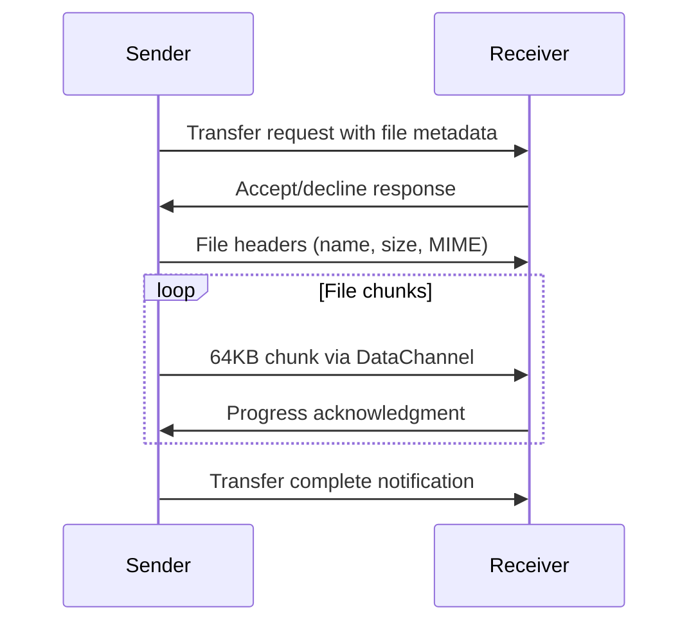

# System Architecture Overview

ErikrafT Drop implements a hybrid client-server architecture where the server facilitates peer discovery and signaling, while actual file transfers occur directly between peers using WebRTC.

## Architecture Components

### Client-Side Architecture

#### Core Classes
The client application is built around several key JavaScript classes:

```javascript
// Main application controller
class ErikrafTdrop {
    constructor() {
        this.serverConnection = new ServerConnection();
        this.peersManager = new PeersManager(serverConnection);
        // UI components and event handlers
    }
}

// WebSocket connection management
class ServerConnection {
    constructor() {
        this._socket = null;
        this._config = null;
        this._lanMode = false;
    }
}

// WebRTC peer connection
class RTCPeer extends Peer {
    constructor(serverConnection, isCaller, peerId, roomType, roomId, rtcConfig) {
        this._conn = new RTCPeerConnection(rtcConfig);
        this._channel = null;
    }
}
```

#### File Transfer System
- **FileChunker**: Breaks files into 64KB chunks with 1MB partitions
- **FileDigester**: Reassembles received chunks into complete files
- **MIME Detection**: Automatic MIME type identification for transferred files

### Server-Side Architecture

#### WebSocket Server
The Node.js server (`ws-server.js`) handles:

```javascript
class ErikrafTdropWsServer {
    constructor(server, conf) {
        this._rooms = {}; // Room management
        this._roomSecrets = {}; // Pairing secrets
        this._keepAliveTimers = {}; // Connection monitoring
    }
}
```

#### Peer Management
- **Peer Class**: Represents connected clients with metadata and capabilities
- **Room System**: Groups peers by IP, secret, or public room IDs
- **Rate Limiting**: Prevents abuse with 10 requests per 10 seconds limit

## Data Flow Architecture

### Connection Establishment Flow

```mermaid
sequenceDiagram
    participant C1 as Client 1
    participant S as Server
    participant C2 as Client 2

    C1->>S: WebSocket connection
    C2->>S: WebSocket connection
    S->>C1: Peer list (includes C2)
    S->>C2: Peer list (includes C1)
    C1->>S: WebRTC offer (via signaling)
    S->>C2: Relay offer
    C2->>S: WebRTC answer (via signaling)
    S->>C1: Relay answer
    C1<-->C2: Direct WebRTC connection
```

### File Transfer Flow



## Network Topology

### Local Network Mode
- **IP-Based Rooms**: Devices with same public IP are grouped together
- **Direct P2P**: WebRTC establishes direct connections when possible
- **LAN Optimization**: No internet bandwidth used for file transfers

### Remote Pairing Mode
- **Secret-Based Rooms**: 256-character encrypted room secrets
- **Persistent Connections**: Paired devices remain discoverable across networks
- **Cross-Network**: Works even when devices are on different networks

## Security Architecture

### Encryption Layers

#### WebRTC Encryption
```javascript
// WebRTC provides automatic encryption
const channel = this._conn.createDataChannel('data-channel', {
    ordered: true,
    reliable: true
});
// DTLS/SRTP encryption handled by browser
```

#### Server Security
- **No File Storage**: Server never handles file content
- **Hashed Identifiers**: Peer IDs are salted with SHA3-512
- **Rate Limiting**: Prevents brute force attacks
- **LAN Mode**: Optional restriction to local networks only

### Authentication Model

#### Device Identification
```javascript
// From peer.js lines 128-136
_setPeerId(request) {
    const searchParams = new URL(request.url, "http://server").searchParams;
    let peerId = searchParams.get('peer_id');
    let peerIdHash = searchParams.get('peer_id_hash');
    if (peerId && Peer.isValidUuid(peerId) && this.isPeerIdHashValid(peerId, peerIdHash)) {
        this.id = peerId;
    } else {
        this.id = crypto.randomUUID();
    }
}
```

#### Pairing Authentication
- **Room Secrets**: 256-character cryptographically random strings
- **Persistent Storage**: IndexedDB stores pairing information
- **Hash Verification**: SHA3-512 ensures secret integrity

## Performance Architecture

### Memory Management

#### File Chunking Strategy
```javascript
// From network.js lines 1671-1672
this._chunkSize = 64000; // 64 KB chunks
this._maxPartitionSize = 1e6; // 1 MB partitions
```

#### iOS Memory Limits
```javascript
// Special handling for iOS devices
if (window.iOS && request.totalSize >= 200*1024*1024) {
    this.sendJSON({type: 'files-transfer-response', accepted: false, reason: 'ios-memory-limit'});
}
```

### Network Optimization

#### Connection Pooling
- **Multiple Rooms**: Single peer can participate in multiple room types
- **Connection Reuse**: Existing WebRTC connections are reused when possible
- **Fallback Mechanism**: WebSocket fallback when WebRTC fails

#### Bandwidth Management
- **Adaptive Chunking**: Smaller chunks for unstable connections
- **Progress Tracking**: Real-time transfer progress monitoring
- **Error Recovery**: Automatic retry mechanisms for failed chunks

## Scalability Considerations

### Server Scalability
- **Stateless Design**: Server maintains minimal state
- **Room Distribution**: Efficient room-based message routing
- **Connection Limits**: Configurable rate limiting and connection caps

### Client Scalability
- **Memory Efficiency**: Streaming file processing
- **Browser Limits**: Respects browser memory constraints
- **Concurrent Transfers**: Multiple simultaneous file transfers supported

## Deployment Architecture

### Production Deployment
- **Node.js Server**: Express.js with WebSocket support
- **Reverse Proxy**: Optional nginx/Apache for SSL termination
- **Process Management**: PM2 or similar for production stability

### Development Environment
- **Docker Support**: Containerized development environment
- **Hot Reload**: Development server with auto-restart
- **Debug Mode**: Enhanced logging for development

## Monitoring and Observability

### Server Metrics
- **Connection Count**: Active WebSocket connections
- **Room Statistics**: Room usage and distribution
- **Error Rates**: Connection failures and transfer errors

### Client Metrics
- **Transfer Speed**: Real-time bandwidth monitoring
- **Connection Quality**: WebRTC connection state tracking
- **Error Reporting**: Client-side error collection

This architecture enables ErikrafT Drop to provide efficient, secure file sharing while maintaining simplicity and browser compatibility.
