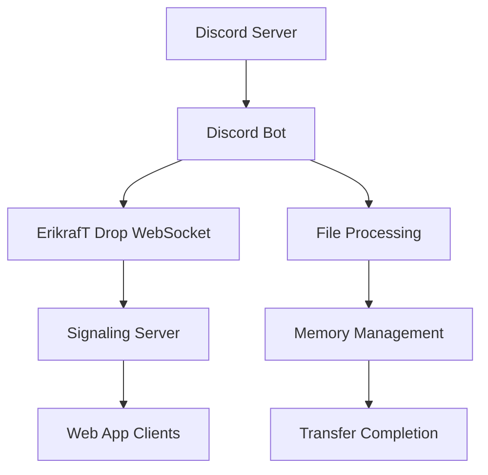
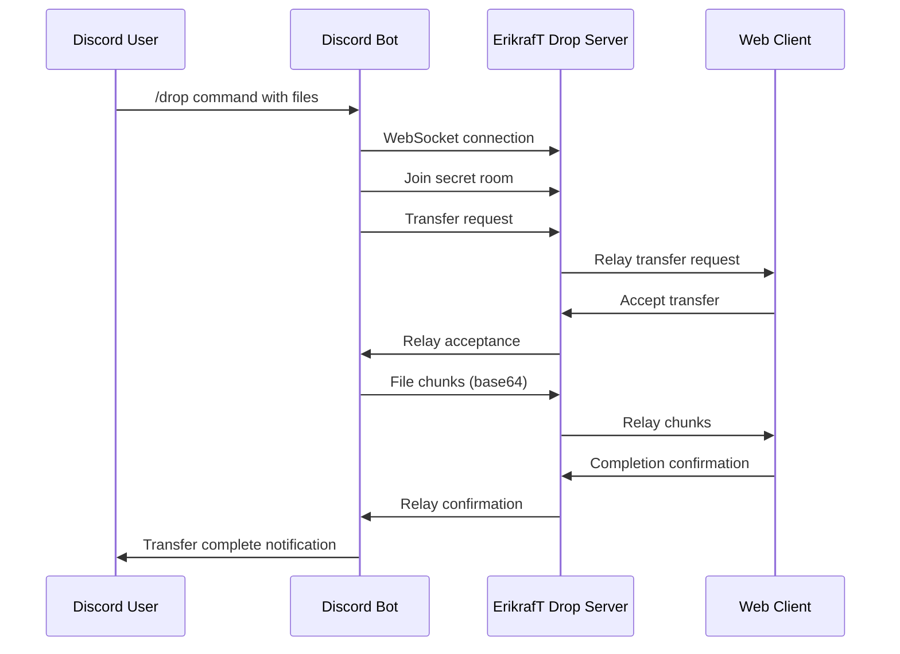

# Discord Bot Integration

The ErikrafT Drop Discord bot brings file sharing capabilities directly to Discord servers, enabling users to send and receive files through Discord commands while maintaining the security and efficiency of the ErikrafT Drop peer-to-peer system.

## Bot Overview

### Core Functionality
The Discord bot provides a bridge between Discord and ErikrafT Drop:
- **Slash Commands**: `/drop` command for file sharing operations
- **Real-time Integration**: Appears as paired device in ErikrafT Drop web interface
- **Multi-file Support**: Send up to 3 files per command
- **Text Messaging**: Send text messages alongside files
- **Bidirectional Transfer**: Send and receive files through Discord

### Technical Architecture


## Installation and Setup

### Bot Invitation
**Invite the bot to your Discord server:**
[https://discord.com/oauth2/authorize?client_id=1367869058707492955](https://discord.com/oauth2/authorize?client_id=1367869058707492955)

### Prerequisites
- **Node.js 18+**: Required for bot operation
- **Discord Server**: Server with bot administration permissions
- **ErikrafT Drop Instance**: With WebSocket fallback enabled
- **Bot Application**: Registered on Discord Developer Portal

### Self-Hosting Setup

#### 1. Discord Application Setup
1. **Create Application**: Visit [Discord Developer Portal](https://discord.com/developers/applications)
2. **Create Bot**: Add bot to application
3. **Configure Permissions**: Set appropriate bot permissions
4. **Generate Token**: Create bot token for authentication

#### 2. Bot Configuration
```bash
# Clone or download the bot code
git clone https://github.com/erikraft/Drop.git
cd Drop/Discord/Bot

# Copy environment configuration
cp .env.example .env

# Install dependencies
npm install
```

#### 3. Environment Variables
Configure `.env` file with required variables:

```bash
# Required Configuration
DISCORD_TOKEN=your_discord_bot_token
DISCORD_APPLICATION_ID=your_application_id

# Optional Configuration
DISCORD_GUILD_ID=your_server_id_for_testing
DROP_BASE_URL=https://drop.erikraft.com
DROP_SIGNALING_URL=wss://drop.erikraft.com/server
```

#### 4. Command Registration
```bash
# Register Discord slash commands
npm run register:commands

# Start the bot
npm start
```

## Bot Architecture

### Project Structure
```
Discord/Bot/
├── src/
│   ├── index.js              # Main bot initialization
│   ├── registerCommands.js   # Command registration utility
│   ├── commands/
│   │   └── drop.js          # /drop command implementation
│   └── client/
│       └── dropClient.js    # ErikrafT Drop WebSocket client
├── .env.example              # Environment variables template
├── package.json              # Node.js dependencies
└── README.md                 # Bot documentation
```

### Core Components

#### Main Bot Instance (`src/index.js`)
```javascript
// Bot initialization and event handling
class ErikrafTDropBot {
    constructor() {
        this.client = new Client({
            intents: [
                GatewayIntentBits.Guilds,
                GatewayIntentBits.GuildMessages,
                GatewayIntentBits.MessageContent
            ]
        });

        this.dropClient = new DropClient();
        this.setupEventHandlers();
    }

    setupEventHandlers() {
        this.client.on('ready', this.onReady.bind(this));
        this.client.on('interactionCreate', this.onInteraction.bind(this));
    }
}
```

#### ErikrafT Drop Client (`src/client/dropClient.js`)
```javascript
// WebSocket client for ErikrafT Drop integration
class DropClient {
    constructor() {
        this.ws = null;
        this.isConnected = false;
        this.clientType = 'discord-bot';
        this.setupWebSocket();
    }

    setupWebSocket() {
        this.ws = new WebSocket(this.getSignalingUrl());
        this.ws.onopen = this.onOpen.bind(this);
        this.ws.onmessage = this.onMessage.bind(this);
        this.ws.onclose = this.onClose.bind(this);
    }

    onOpen() {
        this.isConnected = true;
        this.identifyClient();
    }

    identifyClient() {
        this.ws.send(JSON.stringify({
            type: 'identify',
            client_type: this.clientType
        }));
    }
}
```

#### Drop Command (`src/commands/drop.js`)
```javascript
// /drop slash command implementation
class DropCommand {
    constructor(dropClient) {
        this.dropClient = dropClient;
    }

    async execute(interaction) {
        const { key, name, message, file1, file2, file3 } = interaction.options;

        // Validate pairing key
        if (!this.validateKey(key)) {
            return interaction.reply({
                content: 'Invalid pairing key format',
                ephemeral: true
            });
        }

        // Process files and message
        const files = await this.processFiles([file1, file2, file3]);
        const textMessage = message || null;

        // Initiate transfer
        await this.initiateTransfer(key, name, files, textMessage);

        // Send response
        await interaction.reply({
            content: 'Transfer initiated successfully',
            ephemeral: true
        });
    }
}
```

## Command Usage

### /drop Command
The primary command for file sharing operations:

#### Command Options
```
/drop <key> [name] [message] [file1] [file2] [file3]

Required:
  key         6-digit pairing key from ErikrafT Drop

Optional:
  name        Custom display name for the bot
  message     Text message to send (up to 2000 characters)
  file1       First file to attach
  file2       Second file to attach
  file3       Third file to attach
```

#### Usage Examples

**Basic File Sharing:**
```
/drop key:123456 file1:@document.pdf
```

**With Custom Name:**
```
/drop key:123456 name:"Development Server" file1:@code.zip
```

**Text Message Only:**
```
/drop key:123456 message:"Here are the updated files"
```

**Multiple Files:**
```
/drop key:123456 file1:@image.png file2:@data.csv file3:@report.pdf
```

### Command Features

#### File Handling
- **Multiple Files**: Support for up to 3 files per command
- **File Types**: All file types supported
- **Size Limits**: Respects Discord file size limits
- **Processing**: Files processed in memory without disk storage

#### Message Handling
- **Text Messages**: Send text messages up to 2000 characters
- **Formatting**: Supports Discord markdown formatting
- **Encoding**: Proper character encoding for international text
- **Validation**: Input validation and sanitization

#### Response Handling
- **Ephemeral Messages**: Responses visible only to command user
- **Progress Feedback**: Real-time transfer progress updates
- **Error Handling**: Graceful error handling and user feedback
- **Completion Notification**: Transfer completion confirmation

## Integration Features

### Real-time Device Discovery
The bot appears as a paired device in the ErikrafT Drop web interface:

#### Device Identification
```javascript
// Device identification in web interface
const discordDevice = {
    id: 'discord-bot-' + botId,
    name: 'Discord Bot',
    deviceName: 'Discord Integration',
    browser: 'Discord',
    type: 'discord-bot',
    rtcSupported: false, // Uses WebSocket fallback
    clientType: 'discord-bot'
};
```

#### Connection Status
- **Online Indicator**: Shows when bot is connected
- **Real-time Updates**: Connection status updates in real-time
- **Auto-reconnection**: Automatic reconnection on disconnect
- **Error Reporting**: Connection error notifications

### WebSocket Fallback Integration
The bot uses WebSocket fallback for file transfers:

#### Transfer Process


#### Data Handling
- **Base64 Encoding**: Files encoded as base64 for WebSocket transfer
- **Chunking**: Large files chunked for efficient transfer
- **Memory Management**: Files processed in memory without disk storage
- **Error Recovery**: Automatic retry on transfer failures

## Security Features

### Authentication and Authorization

#### Discord Authentication
- **Bot Token**: Secure Discord bot token authentication
- **Guild Permissions**: Server-specific permission validation
- **Command Permissions**: Role-based command access control
- **User Validation**: Discord user identity verification

#### ErikrafT Drop Integration
- **Pairing Key Validation**: 6-digit key format validation
- **Room Access**: Secure room access through pairing keys
- **Connection Authentication**: WebSocket connection authentication
- **Transfer Authorization**: Transfer request authorization

### Data Protection

#### Privacy Measures
- **No Disk Storage**: Files never written to disk
- **Memory Processing**: All processing in memory only
- **Ephemeral Messages**: Discord responses are ephemeral
- **Secure Transmission**: Encrypted WebSocket transmission

#### Security Best Practices
- **Token Security**: Secure token storage and handling
- **Input Validation**: Comprehensive input validation and sanitization
- **Rate Limiting**: Command rate limiting to prevent abuse
- **Error Handling**: Secure error handling without information leakage

## Performance Optimization

### Memory Management
- **Efficient Processing**: Optimized file processing algorithms
- **Memory Cleanup**: Automatic memory cleanup after transfers
- **Stream Processing**: Stream-based file processing for large files
- **Garbage Collection**: Proper garbage collection practices

### Network Optimization
- **Connection Pooling**: Efficient WebSocket connection management
- **Compression**: Data compression for improved transfer speed
- **Timeout Management**: Appropriate timeout settings
- **Retry Logic**: Intelligent retry mechanisms

### Bot Performance
- **Asynchronous Operations**: Non-blocking file processing
- **Concurrent Handling**: Handle multiple concurrent transfers
- **Resource Management**: Efficient resource utilization
- **Scalability**: Designed for multiple server support

## Deployment Options

### Self-Hosting
Deploy the bot on your own infrastructure:

#### Local Deployment
```bash
# Local development setup
npm install
npm run register:commands
npm start
```

#### Production Deployment
```bash
# Production setup with PM2
npm install --production
pm2 start ecosystem.config.js
```

#### Docker Deployment
```dockerfile
FROM node:18-alpine
WORKDIR /app
COPY package*.json ./
RUN npm ci --only=production
COPY . .
EXPOSE 3000
CMD ["npm", "start"]
```

### Cloud Hosting
Deploy to cloud platforms for 24/7 operation:

#### Recommended Platforms
- **Shard Cloud**: [https://shardcloud.app/pt-br/dash](https://shardcloud.app/pt-br/dash)
- **Discloud**: [https://discloud.com/dashboard](https://discloud.com/dashboard)
- **Heroku**: Platform-as-a-Service deployment
- **DigitalOcean**: Cloud VPS deployment

#### Configuration Examples
```yaml
# Docker Compose example
version: '3.8'
services:
  erikraft-drop-bot:
    build: .
    environment:
      - DISCORD_TOKEN=${DISCORD_TOKEN}
      - DISCORD_APPLICATION_ID=${DISCORD_APPLICATION_ID}
      - DROP_BASE_URL=https://drop.erikraft.com
    restart: unless-stopped
```

## Troubleshooting

### Common Issues

#### Connection Problems
- **WebSocket Connection**: Verify ErikrafT Drop server accessibility
- **Discord API**: Check Discord API status and bot permissions
- **Network Issues**: Verify network connectivity and firewall settings
- **Token Issues**: Validate Discord bot token and application ID

#### Command Issues
- **Command Registration**: Ensure slash commands are properly registered
- **Permissions**: Verify bot has necessary permissions in server
- **Key Validation**: Check pairing key format and validity
- **File Processing**: Verify file size and type constraints

#### Transfer Issues
- **File Size**: Check Discord file size limitations
- **Memory Issues**: Monitor bot memory usage
- **Network Stability**: Verify network stability during transfers
- **Server Status**: Check ErikrafT Drop server status

### Debug Information

#### Bot Diagnostics
```javascript
// Debug logging for troubleshooting
console.log('ErikrafT Drop Bot Debug:', {
    version: package.version,
    discordUser: interaction.user.tag,
    guildId: interaction.guildId,
    connectionStatus: this.dropClient.isConnected,
    lastError: this.lastError
});
```

#### WebSocket Diagnostics
```javascript
// WebSocket connection debugging
this.ws.onopen = () => {
    console.log('WebSocket connected to:', this.signalingUrl);
    console.log('Bot client type:', this.clientType);
};

this.ws.onerror = (error) => {
    console.error('WebSocket error:', error);
    console.error('Connection state:', this.ws.readyState);
};
```

## Future Development

### Planned Enhancements

#### Feature Improvements
- **Additional Commands**: More Discord slash commands
- **File Type Support**: Enhanced file type handling
- **Progress Indicators**: Better progress indication
- **Error Handling**: Improved error handling and user feedback

#### Integration Enhancements
- **Multi-server Support**: Support for multiple Discord servers
- **Role-based Access**: Advanced role-based permissions
- **Custom Commands**: Custom command configuration
- **Webhook Integration**: Discord webhook integration

#### Performance Improvements
- **Caching**: Implement intelligent caching mechanisms
- **Load Balancing**: Support for load balancing
- **Monitoring**: Enhanced monitoring and alerting
- **Scalability**: Improved scalability for large servers

The Discord bot integration provides a powerful bridge between Discord communities and the ErikrafT Drop ecosystem, enabling seamless file sharing within Discord servers while maintaining the security and efficiency of the peer-to-peer file transfer system.
