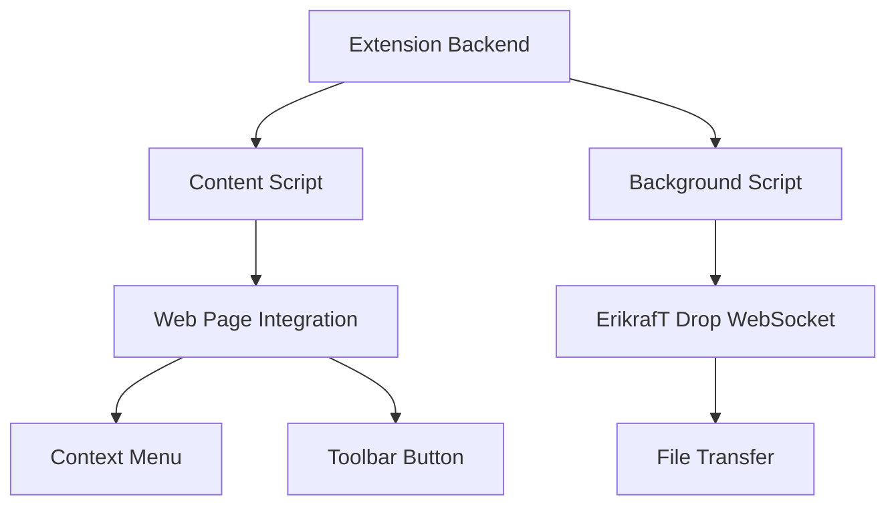

# Browser and IDE Extensions

The ErikrafT Drop extension ecosystem provides seamless integration with popular browsers and development environments, enabling users to share files directly from their preferred tools without interrupting their workflow.

## Extension Overview

### Extension Categories
- **Browser Extensions**: Chrome, Firefox, Opera, and Thunderbird extensions
- **IDE Extensions**: VS Code and Open VSX Registry extensions
- **Integration Types**: Context menu, toolbar, and command palette integration
- **Functionality**: File sharing, code sharing, and workflow integration

### Supported Platforms

#### Browser Extensions
| Browser | Extension Store | Extension ID | Features |
|---------|-----------------|-------------|----------|
| Chrome | Chrome Web Store | Available | Context menu, toolbar |
| Firefox | Firefox Add-ons | Available | Context menu, toolbar |
| Opera | Opera Add-ons | Available | Context menu, toolbar |
| Thunderbird | Thunderbird Add-ons | Available | Email attachment sharing |

#### IDE Extensions
| Platform | Marketplace | Extension ID | Features |
|----------|------------|-------------|----------|
| VS Code | VS Code Marketplace | `ErikrafT.erikraft-drop` | Command palette, explorer |
| Open VSX | Open VSX Registry | `ErikrafT/erikraft-drop` | Command palette, explorer |

## Browser Extensions

### Architecture Overview
Browser extensions use the WebExtensions API for cross-browser compatibility:



### Core Features

#### Context Menu Integration
- **Right-Click Menu**: Adds ErikrafT Drop options to context menu
- **File Selection**: Works with selected files and text
- **URL Sharing**: Share web page URLs directly
- **Image Sharing**: Share images from web pages

#### Toolbar Integration
- **Quick Access**: One-click access to ErikrafT Drop
- **Status Indicator**: Shows connection status
- **Quick Actions**: Rapid file sharing actions
- **Settings Access**: Extension configuration options

#### WebSocket Connection
- **Persistent Connection**: Maintains WebSocket connection
- **Auto-Reconnection**: Automatic reconnection on disconnect
- **Background Operation**: Works in background tabs
- **Error Handling**: Graceful error handling and recovery

### Browser-Specific Implementation

#### Chrome Extension
```javascript
// Chrome extension manifest structure
{
  "manifest_version": 3,
  "name": "ErikrafT Drop",
  "version": "1.0.0",
  "permissions": [
    "contextMenus",
    "activeTab",
    "storage"
  ],
  "background": {
    "service_worker": "background.js"
  },
  "content_scripts": [{
    "matches": ["<all_urls>"],
    "js": ["content.js"]
  }]
}
```

#### Firefox Extension
```javascript
// Firefox extension manifest structure
{
  "manifest_version": 2,
  "name": "ErikrafT Drop",
  "version": "1.0.0",
  "permissions": [
    "contextMenus",
    "activeTab",
    "storage"
  ],
  "background": {
    "scripts": ["background.js"]
  },
  "content_scripts": [{
    "matches": ["<all_urls>"],
    "js": ["content.js"]
  }]
}
```

### Extension Features

#### File Sharing Capabilities
- **Multiple Files**: Select and share multiple files
- **Directory Support**: Share entire directories
- **Large Files**: Handle large file transfers
- **Progress Tracking**: Monitor transfer progress

#### Content Type Support
- **Documents**: PDF, DOC, TXT, and other document formats
- **Images**: JPG, PNG, GIF, WebP, and other image formats
- **Code Files**: Source code files with syntax highlighting
- **Archives**: ZIP, RAR, and other archive formats

#### Integration Points
- **File Explorer**: Integration with browser file explorer
- **Download Manager**: Share downloaded files
- **Web Pages**: Share web page content and URLs
- **Developer Tools**: Integration with browser developer tools

## IDE Extensions

### VS Code Extension

#### Architecture
The VS Code extension integrates with the VS Code extension API:

```typescript
// VS Code extension activation
export function activate(context: vscode.ExtensionContext) {
    // Register commands
    const shareFileCommand = vscode.commands.registerCommand(
        'erikraft-drop.shareFile',
        shareFileHandler
    );

    // Register context menu
    vscode.commands.executeCommand(
        'setContext',
        'erikraft-drop.enabled',
        true
    );

    context.subscriptions.push(shareFileCommand);
}
```

#### Features
- **Command Palette Integration**: Access via Ctrl+Shift+P
- **Explorer Context Menu**: Right-click files in explorer
- **Editor Integration**: Share active editor content
- **Workspace Integration**: Share entire workspace files

#### Commands
```typescript
// Available VS Code commands
- 'erikraft-drop.shareFile': Share selected file
- 'erikraft-drop.shareFolder': Share selected folder
- 'erikraft-drop.shareWorkspace': Share entire workspace
- 'erikraft-drop.connect': Connect to ErikrafT Drop
- 'erikraft-drop.disconnect': Disconnect from ErikrafT Drop
```

### Open VSX Extension

#### Compatibility
The Open VSX extension provides the same functionality as the VS Code extension:
- **Cross-Platform**: Works with VS Code forks
- **Open Source**: Fully open-source implementation
- **Feature Parity**: Same features as VS Code version
- **Community Support**: Community-driven development

#### Installation
```bash
# Install via Open VSX CLI
ovsx install ErikrafT.erikraft-drop

# Or install from VS Code
code --install-extension ErikrafT.erikraft-drop
```

## Installation and Setup

### Browser Extension Installation

#### Chrome Web Store
1. **Visit Store**: [Chrome Web Store](https://chrome.google.com/webstore)
2. **Search**: Search for "ErikrafT Drop"
3. **Install**: Click "Add to Chrome"
4. **Permissions**: Review and grant permissions
5. **Setup**: Configure extension settings

#### Firefox Add-ons
1. **Visit Add-ons**: [Firefox Add-ons](https://addons.mozilla.org/firefox/)
2. **Search**: Search for "ErikrafT Drop"
3. **Install**: Click "Add to Firefox"
4. **Permissions**: Review and grant permissions
5. **Setup**: Configure extension settings

#### Opera Add-ons
1. **Visit Add-ons**: [Opera Add-ons](https://addons.opera.com/)
2. **Search**: Search for "ErikrafT Drop"
3. **Install**: Click "Add to Opera"
4. **Permissions**: Review and grant permissions
5. **Setup**: Configure extension settings

#### Thunderbird Add-ons
1. **Visit Add-ons**: [Thunderbird Add-ons](https://addons.thunderbird.net/)
2. **Search**: Search for "ErikrafT Drop"
3. **Install**: Click "Add to Thunderbird"
4. **Permissions**: Review and grant permissions
5. **Setup**: Configure extension settings

### IDE Extension Installation

#### VS Code Marketplace
1. **Open VS Code**: Launch VS Code
2. **Extensions View**: Press Ctrl+Shift+X
3. **Search**: Search for "ErikrafT Drop"
4. **Install**: Click "Install"
5. **Setup**: Configure extension settings

#### Open VSX Registry
1. **Open VSX**: Visit [Open VSX](https://open-vsx.org/)
2. **Search**: Search for "ErikrafT Drop"
3. **Install**: Follow installation instructions
4. **Setup**: Configure extension settings

## Usage Patterns

### Browser Extension Usage

#### File Sharing Workflow
1. **Select Files**: Select files in browser or file system
2. **Context Menu**: Right-click and select "Share with ErikrafT Drop"
3. **Choose Recipient**: Select target device from list
4. **Transfer**: Files transfer automatically
5. **Confirmation**: Receive transfer confirmation

#### Web Content Sharing
1. **Web Page**: Open web page with content to share
2. **Select Content**: Select text, images, or links
3. **Share Action**: Use context menu or toolbar button
4. **Transfer**: Content transfers to selected device
5. **Completion**: Receive confirmation of successful transfer

### IDE Extension Usage

#### Code Sharing Workflow
1. **Select File**: Select file in VS Code explorer
2. **Context Menu**: Right-click and select "Share with ErikrafT Drop"
3. **Choose Target**: Select destination device
4. **Transfer**: Code files transfer automatically
5. **Confirmation**: Receive transfer confirmation

#### Project Sharing
1. **Select Folder**: Select project folder in explorer
2. **Command Palette**: Use Ctrl+Shift+P and search for ErikrafT Drop commands
3. **Share Project**: Choose "Share Workspace" option
4. **Transfer**: Entire project transfers to target device
5. **Progress**: Monitor transfer progress in status bar

## Technical Implementation

### Extension Architecture

#### Background Script
```javascript
// Background script for WebSocket management
class ErikrafTDropClient {
    constructor() {
        this.ws = null;
        this.isConnected = false;
        this.reconnectAttempts = 0;
        this.maxReconnectAttempts = 5;
    }

    connect() {
        this.ws = new WebSocket('wss://drop.erikraft.com/server');
        this.ws.onopen = this.onOpen.bind(this);
        this.ws.onmessage = this.onMessage.bind(this);
        this.ws.onclose = this.onClose.bind(this);
        this.ws.onerror = this.onError.bind(this);
    }

    onOpen() {
        this.isConnected = true;
        this.reconnectAttempts = 0;
        this.updateStatus('connected');
    }

    onMessage(event) {
        const message = JSON.parse(event.data);
        this.handleMessage(message);
    }

    onClose() {
        this.isConnected = false;
        this.updateStatus('disconnected');
        this.attemptReconnect();
    }

    onError(error) {
        console.error('WebSocket error:', error);
        this.updateStatus('error');
    }
}
```

#### Content Script
```javascript
// Content script for web page integration
class WebPageIntegration {
    constructor() {
        this.setupContextMenu();
        this.setupToolbarButton();
        this.setupFileHandlers();
    }

    setupContextMenu() {
        chrome.contextMenus.create({
            id: 'share-with-erikraft-drop',
            title: 'Share with ErikrafT Drop',
            contexts: ['selection', 'image', 'link', 'page']
        });
    }

    setupToolbarButton() {
        chrome.action.onClicked.addListener((tab) => {
            this.openErikraftTDrop(tab);
        });
    }

    setupFileHandlers() {
        document.addEventListener('contextmenu', (event) => {
            this.handleContextMenu(event);
        });
    }
}
```

### IDE Extension Architecture

#### VS Code Extension API Integration
```typescript
// VS Code extension API usage
export class ErikrafTDropExtension {
    private client: ErikrafTDropClient;
    private statusBarItem: vscode.StatusBarItem;

    constructor() {
        this.client = new ErikrafTDropClient();
        this.statusBarItem = vscode.window.createStatusBarItem(
            vscode.StatusBarAlignment.Right,
            100
        );
        this.setupCommands();
        this.setupContextMenus();
    }

    private setupCommands() {
        const commands = [
            vscode.commands.registerCommand(
                'erikraft-drop.shareFile',
                this.shareFile.bind(this)
            ),
            vscode.commands.registerCommand(
                'erikraft-drop.shareFolder',
                this.shareFolder.bind(this)
            ),
            vscode.commands.registerCommand(
                'erikraft-drop.connect',
                this.connect.bind(this)
            )
        ];

        commands.forEach(command => {
            vscode.extensions.all.forEach(extension => {
                extension.subscriptions.push(command);
            });
        });
    }

    private setupContextMenus() {
        vscode.commands.executeCommand(
            'setContext',
            'erikraft-drop.contextMenu',
            true
        );
    }
}
```

## Configuration and Settings

### Extension Settings

#### Browser Extension Configuration
```javascript
// Extension settings structure
const defaultSettings = {
    serverUrl: 'https://drop.erikraft.com',
    autoConnect: true,
    showNotifications: true,
    enableContextMenu: true,
    enableToolbarButton: true,
    connectionTimeout: 10000,
    retryAttempts: 3
};
```

#### IDE Extension Configuration
```typescript
// VS Code extension settings
interface ErikrafTDropSettings {
    serverUrl: string;
    autoConnect: boolean;
    showProgress: boolean;
    enableStatusBar: boolean;
    enableNotifications: boolean;
    maxFileSize: number;
    supportedFileTypes: string[];
}
```

### Customization Options

#### Server Configuration
- **Custom Server**: Use self-hosted ErikrafT Drop instance
- **Connection Settings**: Configure timeout and retry settings
- **Authentication**: Set up authentication if required
- **SSL/TLS**: Configure secure connection settings

#### User Interface
- **Theme**: Match editor or browser theme
- **Notifications**: Configure notification preferences
- **Status Indicators**: Show/hide connection status
- **Progress Display**: Configure progress indication

## Troubleshooting

### Common Issues

#### Extension Installation Problems
- **Store Access**: Verify access to extension store
- **Permissions**: Check extension permissions
- **Browser Version**: Ensure browser compatibility
- **System Requirements**: Verify system requirements

#### Connection Issues
- **Network Connectivity**: Check internet connection
- **Server Status**: Verify ErikrafT Drop server status
- **Firewall Settings**: Check firewall configuration
- **Proxy Settings**: Verify proxy configuration

#### File Transfer Problems
- **File Size**: Check file size limitations
- **File Type**: Verify supported file types
- **Permissions**: Check file access permissions
- **Storage Space**: Ensure sufficient storage space

### Debug Information

#### Browser Extension Debugging
```javascript
// Debug logging
console.log('ErikrafT Drop Extension Debug Info:', {
    version: chrome.runtime.getManifest().version,
    userAgent: navigator.userAgent,
    connectionStatus: this.isConnected,
    lastError: this.lastError
});
```

#### IDE Extension Debugging
```typescript
// VS Code extension debugging
vscode.window.showInformationMessage(
    `ErikrafT Drop Debug: Version ${extensionManifest.version}, ` +
    `Connection: ${this.isConnected ? 'Connected' : 'Disconnected'}`
);
```

## Future Development

### Planned Enhancements

#### Browser Extensions
- **Enhanced UI**: Improved user interface design
- **Additional Browsers**: Support for additional browsers
- **Advanced Features**: Enhanced file handling capabilities
- **Performance**: Improved performance and responsiveness

#### IDE Extensions
- **Additional IDEs**: Support for additional IDEs
- **Advanced Integration**: Enhanced IDE integration
- **Collaboration Features**: Real-time collaboration capabilities
- **Workflow Automation**: Automated workflow integration

### Technical Improvements
- **WebSocket Optimization**: Enhanced WebSocket performance
- **Security**: Improved security features
- **Reliability**: Enhanced reliability and error handling
- **Performance**: Optimized performance across platforms

The browser and IDE extension ecosystem provides comprehensive integration options for users to access ErikrafT Drop functionality within their preferred tools and workflows, enhancing productivity and maintaining seamless file sharing capabilities.
