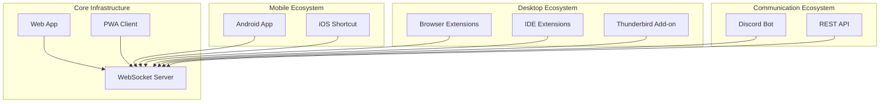
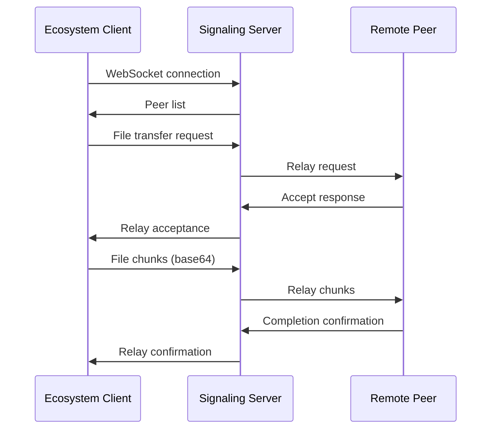

# ErikrafT Drop Ecosystem Overview

The ErikrafT Drop ecosystem extends far beyond the core web application, encompassing native mobile apps, browser extensions, development tools, and platform integrations. This comprehensive ecosystem ensures that ErikrafT Drop can integrate seamlessly into any workflow or platform.

## Ecosystem Components

### Core Platform

- **Web Application**: The primary browser-based file sharing system
- **Signaling Server**: WebSocket server for peer discovery and signaling
- **PWA Support**: Progressive Web App capabilities for native-like experience

### Mobile Applications

- **Android App**: Native Android application with system integration
- **iOS Shortcut**: Apple Shortcuts integration for iOS devices

### Desktop Integrations

- **Browser Extensions**: Chrome, Firefox, Opera, and Thunderbird extensions
- **IDE Extensions**: VS Code and Open VSX Registry extensions
- **System Integration**: Native file system and share menu integration

### Communication Platforms

- **Discord Bot**: File sharing directly within Discord servers
- **API Integration**: RESTful API for custom integrations

## Architecture Overview



## Platform Capabilities

### Web Application

- **Full Feature Set**: Complete ErikrafT Drop functionality
- **Cross-Platform**: Works on any modern browser
- **Real-time Updates**: Always using latest version
- **PWA Installation**: Native app experience possible

### Android Application

- **Native Integration**: Deep Android OS integration
- **Share Menu**: Appears in Android share dialog
- **Background Operation**: Works while using other apps
- **Performance**: Optimized for mobile hardware

### iOS Shortcut

- **Share Sheet Integration**: Native iOS sharing
- **Universal Content**: Supports all shareable content types
- **Quick Access**: One-tap file sharing
- **System Integration**: Works with any iOS app

### Browser Extensions

- **Context Menu**: Right-click file sharing
- **Toolbar Integration**: Quick access from browser toolbar
- **Tab Management**: Persistent connections across browser sessions
- **Developer Tools**: Integration with development workflows

### IDE Extensions

- **Code Sharing**: Share code files directly from IDE
- **Project Integration**: Works with project files and directories
- **Development Workflow**: Streamlined development file sharing
- **Multi-platform**: VS Code and Open VSX support

### Discord Bot

- **Slash Commands**: `/drop` command for file sharing
- **Real-time Sync**: Appears as device in web interface
- **Multi-file Support**: Send multiple files in one command
- **Server Integration**: Works within Discord servers

## Integration Patterns

### Direct WebSocket Connection

Most ecosystem components connect directly to the ErikrafT Drop WebSocket server:

```javascript
// Example connection pattern
const ws = new WebSocket('wss://drop.erikraft.com/server');
ws.onopen = () => {
    ws.send(JSON.stringify({
        type: 'join-ip-room',
        client_type: 'android' // or 'discord-bot', 'vs-code-extension', etc.
    }));
};
```

### Client Type Identification

Each ecosystem component uses a unique client type:

| Component         | Client Type         | Purpose                    |
| ----------------- | ------------------- | -------------------------- |
| Web App           | `browser`           | Standard browser client    |
| Android App       | `android`           | Native Android application |
| VS Code Extension | `vs-code-extension` | VS Code integration        |
| Discord Bot       | `discord-bot`       | Discord server integration |
| Browser Extension | `browseros-browser` | Browser OS integration     |

### Feature Mapping

Different components support different feature sets:

| Feature             | Web App | Android | iOS | Extensions | Discord         |
| ------------------- | ------- | ------- | --- | ---------- | --------------- |
| WebRTC P2P          | ✅       | ✅       | ✅   | ✅          | ❌\*             |
| WebSocket Fallback  | ✅       | ✅       | ✅   | ✅          | ✅               |
| QR Code Scanning    | ✅       | ✅       | ✅   | ❌          | ❌               |
| System Integration  | ❌       | ✅       | ✅   | ✅          | ❌               |
| Auto-Accept         | ✅       | ✅       | ✅   | ✅          | ✅               |
| Multi-file Transfer | ✅       | ✅       | ✅   | ✅          | ✅ (3 files max) |

\*Discord Bot uses WebSocket fallback exclusively

## Data Flow Architecture

### Standard WebRTC Flow

```mermaid
sequenceDiagram
    participant Client as Ecosystem Client
    participant Server as Signaling Server
    participant Peer as Remote Peer

    Client->>Server: WebSocket connection
    Server->>Client: Peer list
    Client->>Server: WebRTC offer
    Server->>Peer: Relay offer
    Peer->>Server: WebRTC answer
    Server->>Client: Relay answer
    Client<-->Peer: Direct P2P connection
```

### WebSocket Fallback Flow



## Security Considerations

### Authentication Methods

- **Anonymous**: No registration required for web app
- **Token-based**: Discord bot uses Discord tokens
- **Device Pairing**: Persistent room secrets for trusted devices
- **Session-based**: Temporary connections for one-time sharing

### Data Privacy

- **No Server Storage**: Files never stored on servers
- **End-to-End Encryption**: WebRTC provides encryption
- **Local Processing**: All processing on client devices
- **Temporary Data**: Only session data stored temporarily

### Platform-Specific Security

- **Android**: Follows Android security guidelines
- **iOS**: Uses iOS Shortcuts security model
- **Browser Extensions**: Follows browser extension security policies
- **Discord Bot**: Uses Discord's security framework

## Development Ecosystem

### Open Source Development

All ecosystem components are open source:

- **GitHub Repositories**: Separate repos for major components
- **Community Contributions**: Welcomes community contributions
- **Translation Support**: Crowdin integration for translations
- **Issue Tracking**: GitHub Issues for bug reports and features

### Build and Deployment

- **Automated Builds**: GitHub Actions for CI/CD
- **Multi-Platform**: Different build pipelines for each platform
- **Release Management**: Coordinated releases across ecosystem
- **Quality Assurance**: Automated testing and code review

### API Consistency

- **WebSocket Protocol**: Consistent across all clients
- **Message Formats**: Standardized JSON message structure
- **Error Handling**: Consistent error reporting across platforms
- **Version Compatibility**: Backward compatibility maintained

## User Experience Design

### Consistent Interface

- **Visual Design**: Consistent branding and design language
- **Interaction Patterns**: Similar user interactions across platforms
- **Feature Parity**: Core features available on all platforms
- **Accessibility**: Accessibility features across ecosystem

### Platform-Specific Optimization

- **Mobile**: Touch-optimized interfaces
- **Desktop**: Keyboard shortcuts and mouse interactions
- **Browser**: Context menus and toolbar integration
- **Discord**: Slash command interface

### Onboarding Experience

- **Quick Start**: Minimal setup required
- **Progressive Disclosure**: Features revealed as needed
- **Help Integration**: Context-sensitive help and documentation
- **Error Recovery**: Graceful handling of errors

## Performance Optimization

### Network Optimization

- **Connection Reuse**: Persistent connections where possible
- **Chunked Transfer**: Optimized file chunking for different platforms
- **Compression**: Data compression for WebSocket fallback
- **Caching**: Local caching for improved performance

### Resource Management

- **Memory Efficiency**: Optimized memory usage for mobile devices
- **Battery Optimization**: Minimized battery impact on mobile
- **Background Processing**: Efficient background operations
- **Resource Cleanup**: Proper cleanup of connections and resources

## Future Ecosystem Development

### Planned Expansions

- **Desktop Apps**: Native desktop applications
- **API Platform**: Public API for third-party integrations
- **Enterprise Features**: Advanced features for organizations
- **Cloud Integration**: Integration with cloud storage services

### Technology Evolution

- **WebRTC Improvements**: Leveraging new WebRTC capabilities
- **PWA Enhancements**: Enhanced PWA features
- **Mobile Optimization**: Continued mobile platform optimization
- **Security Enhancements**: Ongoing security improvements

The ErikrafT Drop ecosystem provides comprehensive file sharing capabilities across virtually all platforms and use cases, ensuring users can share files securely and efficiently regardless of their preferred tools or workflows.