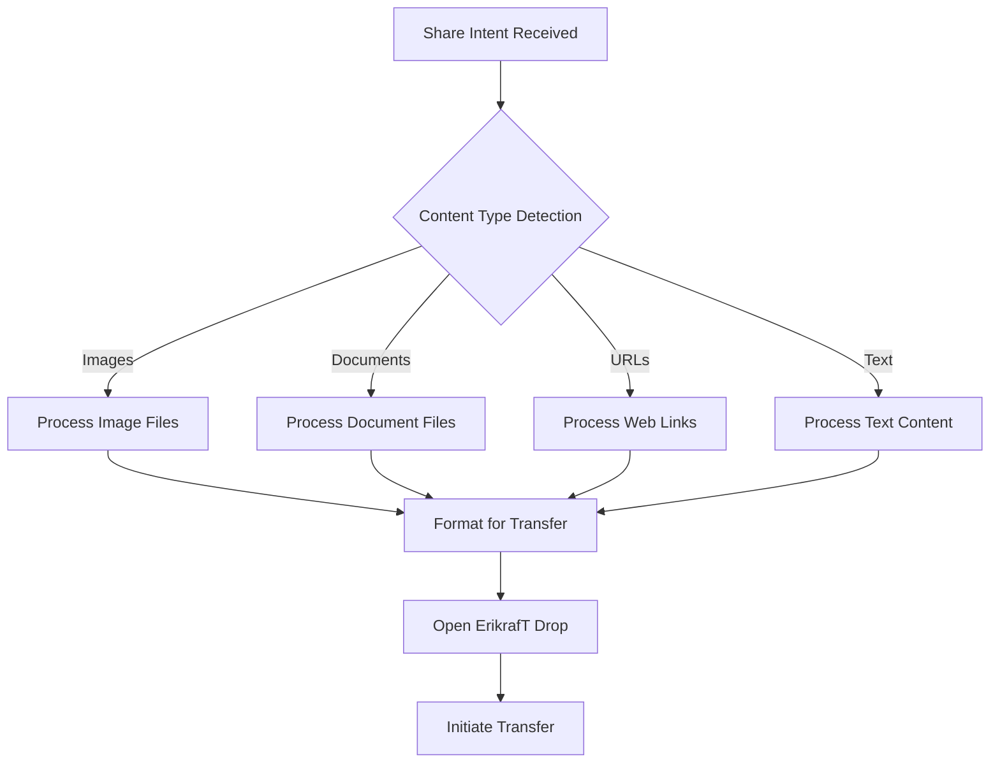

# iOS Shortcut Integration

The ErikrafT Drop iOS Shortcut provides seamless integration with Apple's Shortcuts app, enabling users to share files directly from the iOS share menu. This integration brings ErikrafT Drop functionality to iOS devices while maintaining the native iOS user experience.

## Overview

### What is the iOS Shortcut?
The ErikrafT Drop iOS Shortcut is a custom Apple Shortcuts workflow that:
- **Integrates with iOS Share Sheet**: Appears in the share menu across all iOS apps
- **Supports Universal Content**: Handles images, files, folders, URLs, and text
- **Provides Quick Access**: One-tap file sharing to ErikrafT Drop devices
- **Maintains Native Experience**: Uses iOS-native interface and interactions

### Technical Approach
The shortcut uses iOS Shortcuts app capabilities to:
- **Receive Share Intent**: Capture content from iOS share menu
- **Process Content**: Handle different content types appropriately
- **Launch Web App**: Open ErikrafT Drop web application
- **Initiate Transfer**: Automatically start file transfer process

## Installation and Setup

### Download Sources

#### Primary Sources
- **RoutineHub**: [https://routinehub.co/shortcut/24753/](https://routinehub.co/shortcut/24753/)
- **iCloud Shortcuts**: [https://www.icloud.com/shortcuts/f81dbac00823445e8feefd0f834b40e7](https://www.icloud.com/shortcuts/f81dbac00823445e8feefd0f834b40e7)
- **GitHub Direct**: [https://github.com/erikraft/Drop/raw/refs/heads/master/Shortcut/ErikrafT%20Drop.shortcut](https://github.com/erikraft/Drop/raw/refs/heads/master/Shortcut/ErikrafT%20Drop.shortcut)

### Installation Process

#### Step 1: Download the Shortcut
1. Open one of the download links on your iOS device
2. The Shortcuts app will automatically open
3. Review the shortcut actions and permissions

#### Step 2: Add to Shortcuts Library
1. Tap "Add Shortcut" to add it to your library
2. If prompted, enable "Allow Untrusted Shortcuts" in Settings
3. Go to **Settings > Shortcuts > Allow Untrusted Shortcuts** and toggle on

#### Step 3: Test the Shortcut
1. Open any app with shareable content (Photos, Files, Safari)
2. Select content to share
3. Tap the Share button
4. Find "ErikrafT Drop" in the share sheet
5. Tap to test the integration

## Shortcut Architecture

### Internal Structure
The iOS Shortcut consists of several key components:



### Content Type Handling

#### Image Processing
- **Supported Formats**: HEIC, JPEG, PNG, GIF, WebP, TIFF
- **Metadata Preservation**: Maintains image metadata when possible
- **Size Optimization**: Handles large images efficiently
- **Multiple Selection**: Supports multiple image selection

#### Document Processing
- **File Types**: PDF, DOC, DOCX, TXT, RTF, and more
- **File Size**: Handles large documents through streaming
- **Metadata**: Preserves document metadata
- **Compression**: Optimizes file transfer when needed

#### URL Processing
- **Web Links**: Captures and processes web URLs
- **URL Validation**: Validates URL format and accessibility
- **Title Extraction**: Attempts to extract page titles
- **Metadata**: Preserves URL metadata when available

#### Text Processing
- **Plain Text**: Handles plain text content
- **Rich Text**: Processes rich text formatting
- **Character Encoding**: Handles various character encodings
- **Length Limits**: Respects iOS text length limitations

## Technical Implementation

### Shortcut Actions
The shortcut uses various iOS Shortcuts actions:

#### Core Actions
```shortcuts
1. Get Input from Share Sheet
2. Get Type of Input
3. Conditional Logic for Content Type
4. Format Content for Transfer
5. Open URL (ErikrafT Drop)
6. Wait for Web App Load
7. Trigger File Transfer
```

#### Error Handling
- **Content Validation**: Validates input content before processing
- **Network Check**: Verifies network connectivity
- **Fallback Actions**: Provides alternative actions for errors
- **User Feedback**: Shows appropriate error messages

### Integration Points

#### iOS Share Sheet Integration
The shortcut registers with iOS share sheet through:
- **Content Type Registration**: Registers for multiple MIME types
- **Share Menu Positioning**: Appears in appropriate share menu sections
- **Icon Display**: Uses ErikrafT Drop branding in share menu
- **Title Display**: Shows "ErikrafT Drop" as action name

#### Web App Communication
Communicates with ErikrafT Drop web app through:
- **URL Scheme Integration**: Uses custom URL schemes if available
- **Web App Launch**: Opens web app with pre-populated transfer data
- **State Management**: Maintains transfer state across app switches
- **Completion Handling**: Handles transfer completion and errors

## Usage Patterns

### Common Use Cases

#### Photo Sharing
1. **Open Photos App**: Select photos to share
2. **Share Menu**: Tap share button
3. **Select ErikrafT Drop**: Choose from share sheet
4. **Auto-Transfer**: Photos automatically transfer to paired devices

#### Document Sharing
1. **Files App**: Select documents or folders
2. **Share Action**: Tap share button
3. **Choose ErikrafT Drop**: Select from share menu
4. **Transfer Initiation**: Documents transfer to target device

#### Web Content Sharing
1. **Safari Browser**: Find content to share
2. **Share Button**: Tap share icon
3. **Select ErikrafT Drop**: Choose from share options
4. **Link Transfer**: URL transfers to paired device

#### Text Sharing
1. **Notes App**: Select text content
2. **Share Function**: Use share feature
3. **ErikrafT Drop**: Select from share menu
4. **Text Transfer**: Text content transfers to target device

### Advanced Usage

#### Batch Operations
- **Multiple Files**: Select multiple files for batch transfer
- **Mixed Content**: Share different content types simultaneously
- **Sequential Transfer**: Process multiple items in sequence
- **Progress Tracking**: Monitor transfer progress for multiple items

#### Workflow Integration
- **Automation**: Combine with other shortcuts for automated workflows
- **Conditional Logic**: Add conditional logic based on content type
- **Multi-Device**: Share to multiple devices in sequence
- **Scheduling**: Schedule transfers for optimal timing

## Limitations and Constraints

### iOS Platform Limitations

#### Background Processing
- **Background Limits**: Limited background execution
- **App Switching**: Requires app switching for completion
- **State Management**: Limited state persistence
- **Resource Constraints**: Memory and processing limitations

#### File System Access
- **Sandboxing**: iOS app sandboxing restrictions
- **File Access**: Limited file system access
- **Storage Limits**: Temporary storage constraints
- **Permission Model**: iOS permission system limitations

#### Network Constraints
- **Network Dependency**: Requires active network connection
- **Background Network**: Limited background network access
- **Connection Stability**: Vulnerable to network interruptions
- **Timeout Limits**: iOS timeout constraints

### Shortcut-Specific Limitations

#### Action Limitations
- **Action Count**: Limited number of actions per shortcut
- **Complexity**: Limited logical complexity
- **Performance**: Performance constraints for complex shortcuts
- **Debugging**: Limited debugging capabilities

#### Content Limitations
- **File Size**: Large file handling limitations
- **Content Types**: Limited content type support
- **Metadata**: Limited metadata preservation
- **Encoding**: Character encoding limitations

## Troubleshooting

### Common Issues

#### Installation Problems
- **Untrusted Shortcuts**: Enable "Allow Untrusted Shortcuts" in Settings
- **iOS Version**: Verify iOS compatibility (iOS 12+)
- **Shortcuts App**: Ensure Shortcuts app is updated
- **Storage Space**: Check available device storage

#### Share Menu Issues
- **Missing from Share Menu**: Check shortcut is properly installed
- **Wrong Section**: Look in appropriate share menu section
- **Content Type**: Verify content type is supported
- **App Permissions**: Check app permissions for content access

#### Transfer Issues
- **Network Connection**: Verify active internet connection
- **Web App Loading**: Ensure ErikrafT Drop web app loads properly
- **Device Pairing**: Verify devices are properly paired
- **Transfer Completion**: Wait for transfer to complete

#### Performance Issues
- **Large Files**: Large files may take longer to process
- **Multiple Items**: Batch processing may be slower
- **Device Performance**: Older devices may be slower
- **Network Speed**: Network speed affects transfer time

### Debug Information

#### Shortcut Diagnostics
- **Action Log**: Review shortcut action log in Shortcuts app
- **Error Messages**: Note any error messages displayed
- **Performance**: Monitor shortcut execution time
- **Success Rate**: Track success vs failure rate

#### iOS Diagnostics
- **System Logs**: Check iOS logs for relevant information
- **Network Status**: Verify network connectivity and speed
- **Storage Status**: Check available storage space
- **App Status**: Verify app and system status

## Best Practices

### Usage Recommendations

#### Content Selection
- **Appropriate Content**: Share appropriate content types
- **File Size**: Consider file size for performance
- **Network Conditions**: Use on stable network connections
- **Device Compatibility**: Ensure target device compatibility

#### Workflow Optimization
- **Batch Processing**: Group similar content for efficiency
- **Timing**: Use during optimal network conditions
- **Device Preparation**: Ensure target devices are ready
- **Completion Verification**: Verify transfer completion

### Security Considerations

#### Content Security
- **Sensitive Content**: Be cautious with sensitive content
- **Network Security**: Use secure network connections
- **Device Trust**: Only share with trusted devices
- **Content Verification**: Verify content before sharing

#### Privacy Protection
- **Personal Data**: Protect personal information
- **Sharing Scope**: Limit sharing to intended recipients
- **Content Lifecycle**: Manage content lifecycle appropriately
- **Access Control**: Control access to shared content

## Future Development

### Potential Enhancements

#### iOS Integration Improvements
- **Background Processing**: Enhanced background operation
- **Native App**: Potential native iOS app development
- **Widget Support**: Home screen widget for quick access
- **Siri Integration**: Voice command integration

#### Feature Enhancements
- **Advanced Content Types**: Support for additional content types
- **Batch Operations**: Enhanced batch processing capabilities
- **Progress Tracking**: Improved progress indication
- **Error Recovery**: Enhanced error handling and recovery

#### Performance Optimizations
- **Speed Improvements**: Faster processing and transfer
- **Memory Efficiency**: Improved memory usage
- **Network Optimization**: Enhanced network performance
- **Battery Efficiency**: Reduced battery consumption

The iOS Shortcut integration provides an elegant, native solution for iOS users to access ErikrafT Drop functionality while maintaining the familiar iOS user experience and leveraging the capabilities of Apple's Shortcuts ecosystem.
