# ErikrafT Drop™ Failover Architecture

## Overview

This document describes the high-availability and emergency failover architecture for ErikrafT Drop™.

The architecture uses:

- Cloudflare as the public entry point and failover routing layer;
- Render as the primary ErikrafT Drop™ application server;
- Vercel as the emergency fallback deployment;
- No database;
- No shared session storage;
- No CodeSpaces/Codespaces dependency;
- No modification of the core application architecture unless required for the fallback implementation.

The primary objective is:

> Keep [https://drop.erikraft.com](https://drop.erikraft.com) available even when the Render service becomes temporarily unavailable.

The fallback is intentionally separated into two levels:

1. Primary application: Render with the complete ErikrafT Drop™ backend and WebSocket signaling.
2. Emergency frontend fallback: Vercel serving a static/compatible fallback deployment.

A Vercel frontend-only deployment must not be described as a complete ErikrafT Drop™ server because it cannot automatically replace the Render WebSocket/signaling process without an appropriate WebSocket architecture.

---

## Architecture

### Production Architecture

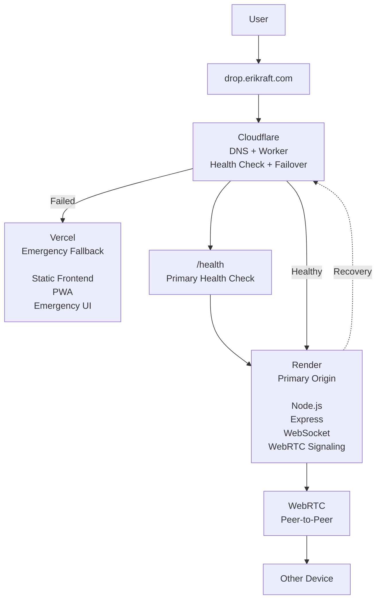

---

## Important Origin Separation

The public domain and origin domains must be separated.

### Public Domain

`https://drop.erikraft.com`

This is the address users access. It points to Cloudflare and is controlled by the failover layer.

### Render Origin

Use a dedicated origin hostname for the Render service. Example:

`https://drop-render.erikraft.com`

This hostname must point directly to the Render deployment through Cloudflare DNS if required, but it must not be routed through the failover Worker.

The Worker uses this hostname for:

- Health checks;
- HTTP proxying;
- WebSocket proxying;
- Primary-origin requests.

### Vercel Fallback Origin

The fallback deployment is:

`https://drop-fallback.erikraft.com`

A second fallback hostname may also exist:

`https://dropfallback.erikraft.com`

Only one should be configured as the canonical emergency origin unless there is a specific reason to maintain both.

---

## Why the Origin Must Be Separate

The following architecture is incorrect:

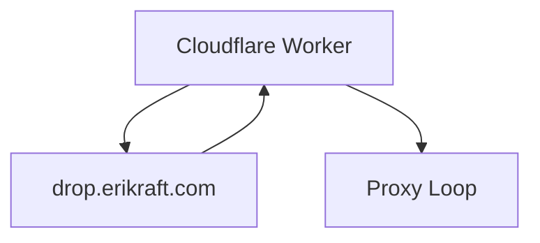

This can create a proxy loop.

The correct architecture is:

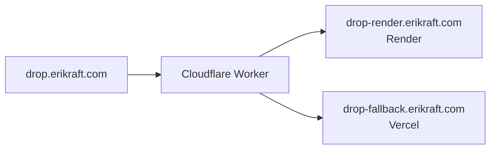

The Worker must always communicate with the origin hostnames, never with the public failover hostname.

---

## Components

### 1. Cloudflare — Public Gateway and Failover Layer

Cloudflare is responsible for exposing:

`https://drop.erikraft.com`

The Cloudflare Worker performs:

- Primary-origin health checks;
- Failover decisions;
- Recovery decisions;
- HTTP request proxying;
- WebSocket upgrade/proxy handling where supported;
- Response headers identifying the active origin;
- Anti-flapping protection;
- Short-lived health-state caching.

The Worker is the traffic controller. It does not store application sessions or transferred files.

### 2. Render — Primary Application

Render is the primary runtime for ErikrafT Drop™. Example origin:

`https://drop-render.erikraft.com`

The primary application contains:

- Node.js;
- Express;
- WebSocket signaling;
- WebRTC signaling infrastructure;
- ErikrafT Drop™ frontend;
- Server-side configuration;
- Any currently supported Tor/Onion-related integration.

Render remains the authoritative application server during normal operation.

### 3. Vercel — Emergency Fallback

Vercel provides an independent deployment of the ErikrafT Drop™ frontend. Example:

`https://drop-fallback.erikraft.com`

Its purpose is to prevent the public domain from becoming completely unavailable when Render fails.

The fallback deployment should contain:

- ErikrafT Drop™ frontend;
- Static assets;
- JavaScript;
- CSS;
- PWA resources;
- Manifest;
- Service Worker;
- Emergency/fallback information when required.

However:

> A frontend-only Vercel deployment is not a complete replacement for the Render application.

If the current Vercel deployment does not provide compatible WebSocket signaling, it must not claim to provide full file-transfer functionality.

---

## Failover Levels

The architecture uses three operational states.

### State 1 — Primary

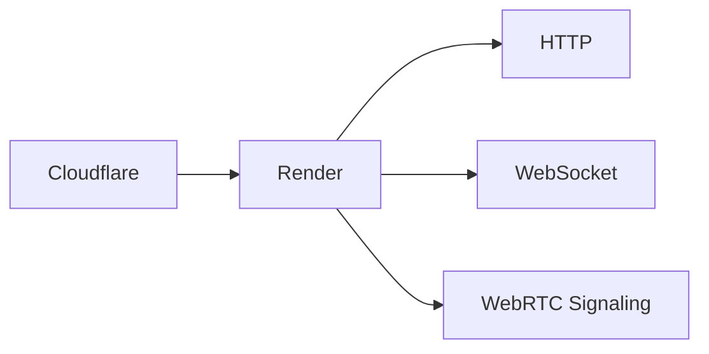

Everything operates normally. Users receive the complete ErikrafT Drop™ application.

Response header: `X-Erikraft-Drop-Server: primary`

### State 2 — Emergency Fallback

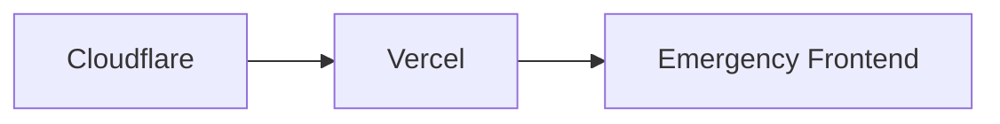

This state occurs when the Render origin cannot be reached or fails the configured health policy.

Response header: `X-Erikraft-Drop-Server: fallback`

The fallback deployment should clearly communicate limitations if the complete signaling service is unavailable.

### State 3 — Recovery

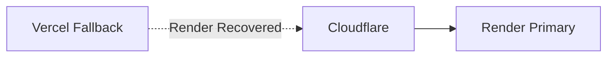

When Render becomes healthy again, new requests return to Render.

Response header: `X-Erikraft-Drop-Server: primary`

The fallback remains deployed and ready for the next incident.

---

## Health Check Architecture

The Worker must check the Render origin, not the public failover domain.

Correct:

```text
Worker
   |
   v
[https://drop-render.erikraft.com/health](https://drop-render.erikraft.com/health)
```

Incorrect:

```text
Worker
   |
   v
[https://drop.erikraft.com/health](https://drop.erikraft.com/health)
```

The second configuration can route back through the Worker itself.

---

## Health Endpoint

The Render application should expose:

`GET /health`

Example response:

```text
200 OK
ok
```

The endpoint should be intentionally lightweight. It should verify that the application process is alive and able to accept HTTP requests. It should not perform unnecessary expensive operations.

---

## Health State

The Worker maintains a small amount of temporary health state. Example states:

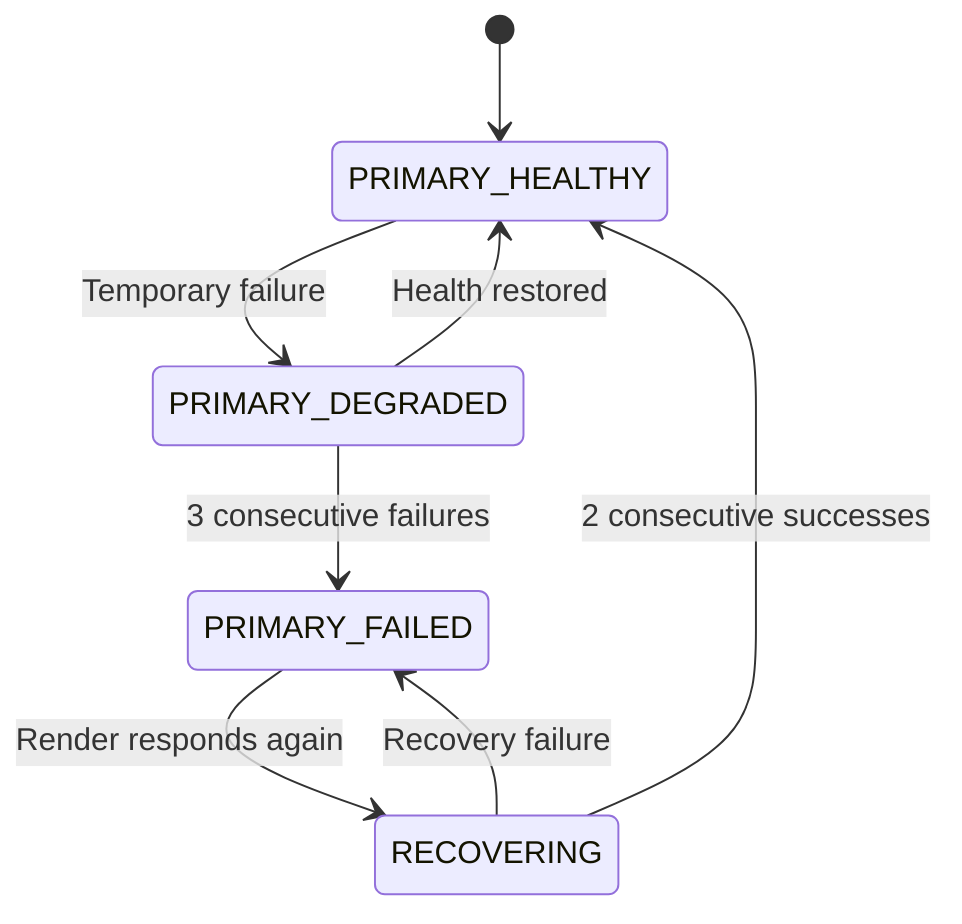

The state should not be persisted in a database. The Worker can use its supported edge/runtime state mechanisms or a short-lived cached health result. The failover system does not require a database.

---

## Anti-Flapping Protection

The Worker must not switch servers after a single transient error.

Recommended configuration:

| Setting | Recommended value |
| --- | --- |
| Health interval | 30 seconds |
| Failure threshold | 3 consecutive failures |
| Recovery threshold | 2 consecutive successes |

This produces approximately: `3 × 30s = 90 seconds` before declaring the primary unavailable.

Recovery requires approximately: `2 × 30s = 60 seconds` of successful health checks.

These values are configurable and should be tuned according to real Render behavior.

---

## Normal Operation

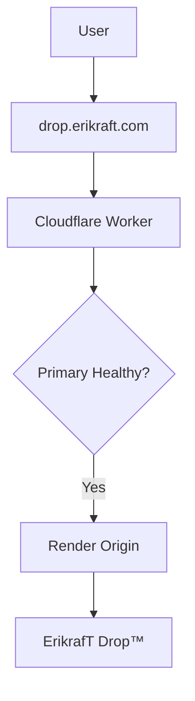

The Worker forwards:

- HTTP requests;
- WebSocket upgrade requests;
- Required headers;
- Query strings;
- Request paths.

The user continues using the normal ErikrafT Drop™ service.

---

## Failover Operation

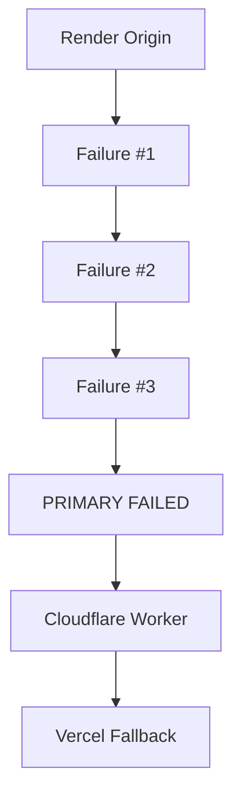

After the configured threshold, new HTTP requests are sent to the fallback deployment.

---

## Recovery Operation

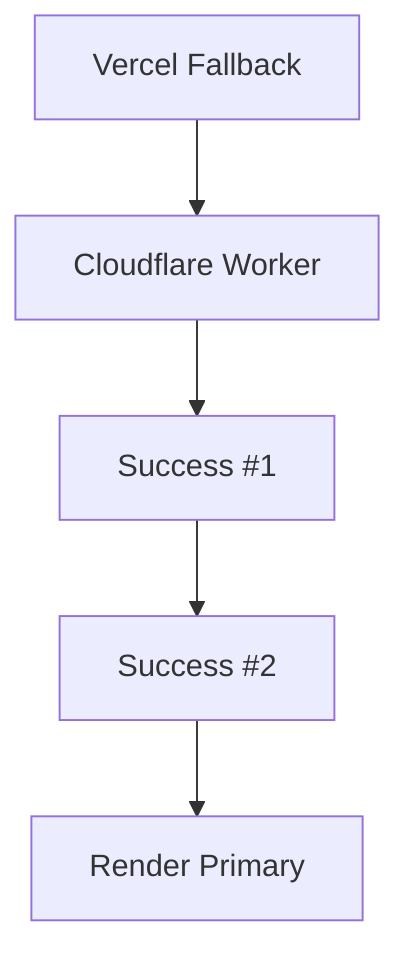

The fallback remains deployed and ready for the next incident.

---

## WebSocket Architecture

WebSocket connections require special treatment. The Worker must preserve the WebSocket upgrade request when proxying to Render.

The expected production path is:

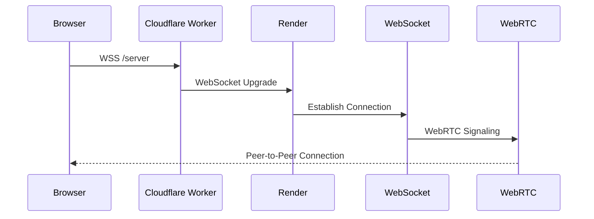

The Render WebSocket service remains the primary signaling service.

**Important**

Failover does not migrate existing WebSocket connections. If Render becomes unavailable, existing connections may disconnect and the client must reconnect. If the fallback deployment does not provide compatible WebSocket signaling, the fallback cannot provide normal pairing/file-transfer functionality.

---

## WebRTC Architecture

ErikrafT Drop™ uses WebRTC for peer-to-peer communication. The architecture therefore separates signaling from data transfer:

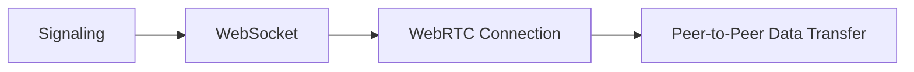

The failover layer primarily protects the HTTP/signaling entry point. It does not automatically migrate an already-established WebRTC connection. If the signaling server disappears, an existing P2P connection may remain alive temporarily, but new signaling or reconnection can fail.

---

## Session Management

No shared database is required. Sessions are considered ephemeral.

When Render fails:

- Existing Render WebSocket sessions may be lost;
- Existing pairing state may be lost;
- Users may need to reconnect;
- The Worker does not migrate sessions;
- Vercel does not receive Render's in-memory session state.

This is intentional. The architecture prioritizes:

- simplicity;
- privacy;
- no database dependency;
- minimal infrastructure;
- low operating cost.

---

## Vercel Fallback Requirements

The Vercel deployment should be treated as an Emergency Frontend Fallback unless it implements compatible signaling.

It should:

- Load successfully;
- Serve all required static assets;
- Serve the PWA manifest;
- Serve the Service Worker;
- Work over HTTPS;
- Avoid broken references to the Render-only origin;
- Clearly handle unavailable signaling services;
- Avoid pretending that a WebSocket connection exists when it does not.

The fallback should not silently present a fully functional transfer interface if the backend required by that interface is unavailable.

---

## Public DNS

The public domain: `drop.erikraft.com` must be proxied through Cloudflare.

Conceptually:

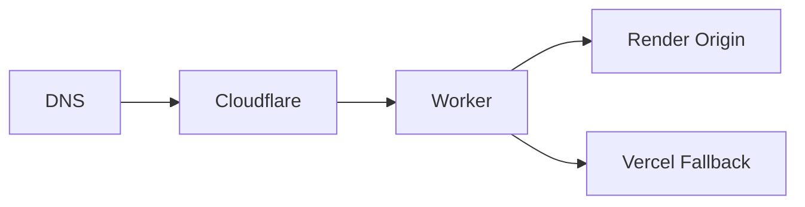

The origin services should be separately addressable: `drop-render.erikraft.com` `drop-fallback.erikraft.com`

The exact Render hostname can be hidden behind the dedicated origin hostname.

---

## Cloudflare Worker Routing

The Worker should conceptually implement:

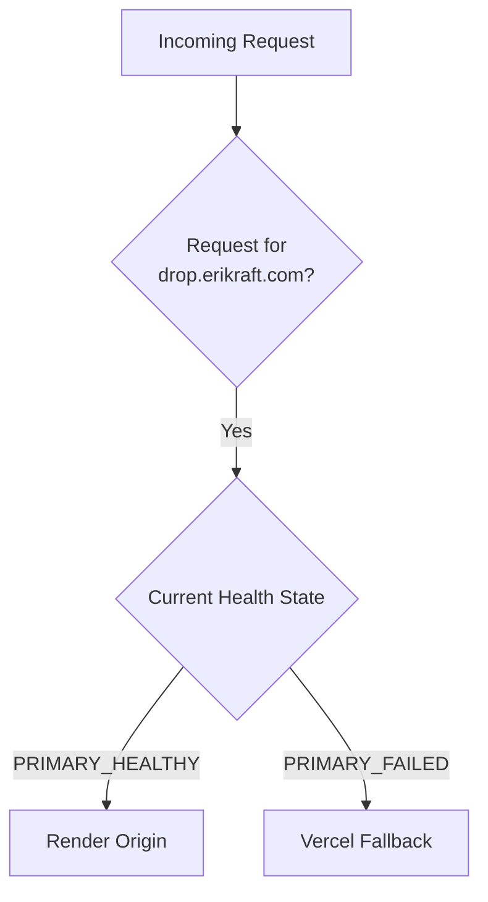

The Worker must not use: `drop.erikraft.com` as its Render origin. It must use the dedicated Render origin hostname.

---

## Response Headers

For diagnostics, the Worker may add: `X-Erikraft-Drop-Server: primary` or: `X-Erikraft-Drop-Server: fallback`

Optionally: `X-Erikraft-Drop-Failover: active`

These headers are diagnostic only. They must not expose sensitive infrastructure information.

---

## Health Check Testing

### Render

Test the dedicated origin: `curl -i https://drop-render.erikraft.com/health`

Expected:

```text
HTTP/2 200
...
ok
```

### Public Endpoint

Test: `curl -I https://drop.erikraft.com/`

Expected during normal operation: `X-Erikraft-Drop-Server: primary`

During fallback: `X-Erikraft-Drop-Server: fallback`

---

## WebSocket Testing

Test the public endpoint: `wscat -c wss://drop.erikraft.com/server`

During normal operation, the connection should reach Render. Do not use the Vercel fallback as a WebSocket test unless the fallback deployment has explicitly implemented a compatible WebSocket signaling service.

---

## Failover Test

A controlled test should be performed without permanently modifying production.

**Step 1 — Verify Primary** `curl -i https://drop-render.erikraft.com/health` Expected: `200 OK`

**Step 2 — Verify Public Routing** `curl -I https://drop.erikraft.com/` Expected: `X-Erikraft-Drop-Server: primary`

**Step 3 — Simulate Failure** Temporarily make the Render origin unavailable. Do not change DNS to simulate failure.

The Worker should detect:

- Failure #1
- Failure #2
- Failure #3

**Step 4 — Verify Fallback** `curl -I https://drop.erikraft.com/` Expected: `X-Erikraft-Drop-Server: fallback`

**Step 5 — Restore Render** Restore the Render service. Wait for:

- Success #1
- Success #2

Then verify: `X-Erikraft-Drop-Server: primary`

---

## Monitoring

### Cloudflare

Monitor:

- Worker execution;
- health-check failures;
- failover events;
- recovery events;
- HTTP errors;
- WebSocket upgrade failures.

### Render

Monitor:

- service status;
- health endpoint;
- WebSocket connections;
- application errors;
- CPU/memory;
- deployment failures;
- free-tier/resource suspension.

### Vercel

Monitor:

- deployment status;
- build failures;
- static asset failures;
- runtime errors if functions are used;
- domain availability.

---

## Troubleshooting

### Requests Always Use Vercel

Possible causes:

1. Render origin is actually unavailable;
2. `/health` is returning a non-2xx status;
3. Worker health state is stale;
4. Dedicated Render origin is incorrectly configured;
5. Worker route is incorrect;
6. DNS for the Render origin is incorrect.

Check: `curl -i https://drop-render.erikraft.com/health` Then inspect Cloudflare Worker logs.

### Requests Never Fail Over

Possible causes:

1. Worker is not receiving the production request;
2. Worker route is not attached to `drop.erikraft.com/*`;
3. Health state is incorrectly cached;
4. Failure detection is too permissive;
5. The Worker is checking the wrong hostname.

Verify that the health check target is: `drop-render.erikraft.com` and not: `drop.erikraft.com`

### WebSocket Fails on Primary

Check:

1. Render WebSocket server;
2. WebSocket path;
3. Cloudflare Worker upgrade handling;
4. Origin hostname;
5. TLS;
6. Render logs.

Expected path:

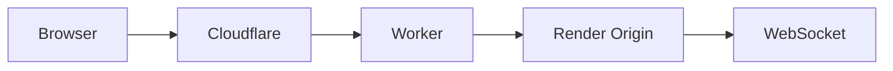

### WebSocket Fails During Fallback

If the Vercel deployment is frontend-only, this is expected. The fallback should instead provide a controlled emergency experience rather than pretending that full P2P signaling is available. A complete failover of the transfer service requires a compatible signaling architecture.

### Flapping Between Render and Vercel

If the service switches repeatedly: Increase:

- `FAILURE_THRESHOLD`
- `RECOVERY_THRESHOLD`

or increase the health-check interval. The objective is to avoid changing origin because of a single temporary network failure.

---

## Security Considerations

The failover layer must:

- Use HTTPS everywhere;
- Use secure WebSocket connections;
- Avoid exposing internal origin details unnecessarily;
- Validate WebSocket upgrade requests;
- Preserve appropriate security headers;
- Avoid storing transferred files;
- Avoid introducing a central file-storage system;
- Avoid logging sensitive transfer data.

The Worker must not become a file-transfer storage layer.

---

## Privacy Model

The architecture does not introduce a database. There is no requirement for:

- Redis
- PostgreSQL
- MongoDB
- MySQL or another persistent session database.

The purpose of the failover system is routing, not storage. Transferred data should continue to follow the normal ErikrafT Drop™ WebRTC architecture.

---

## No Codespaces Dependency

This architecture does not depend on GitHub Codespaces or any cloud development environment.

Production infrastructure consists of:

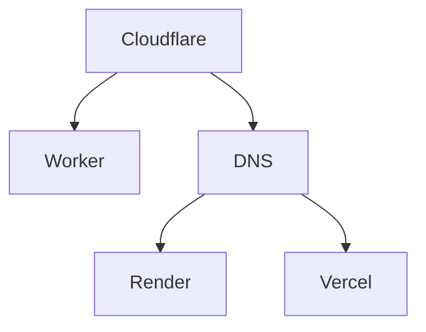

Development can be performed locally and deployed through the normal Git/deployment workflow.

---

## Recommended Repository Structure

The failover implementation should be isolated from the main application as much as practical.

Example:

```text
/
├── cloudflare-worker/
│   ├── failover.js
│   ├── wrangler.toml
│   └── package.json
│
├── server/
│   └── server.js
│
├── public/
│
├── docs/
│
└── ...
```

The Render application remains the primary application. The Cloudflare Worker is an infrastructure component. The Vercel deployment is an independent fallback deployment.

---

## Future Full-Failover Architecture

If complete service continuity is required, the architecture should eventually separate the frontend from signaling.

Recommended model:

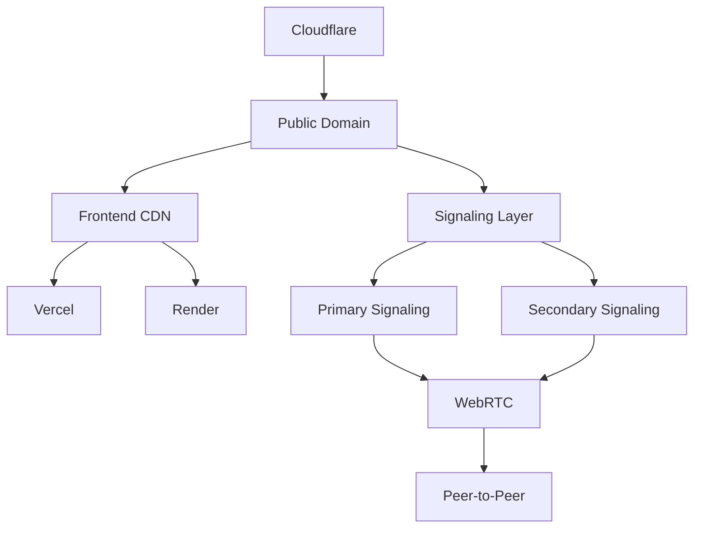

This architecture allows:

- Frontend redundancy;
- Independent signaling redundancy;
- Multiple signaling servers;
- Geographic redundancy;
- Better recovery;
- Reduced dependency on a single Render instance.

However, it introduces considerably more complexity. It should not be implemented merely to solve Render Free-tier suspension unless that complexity is justified.

---

## Future Multi-Origin Architecture

For higher availability:

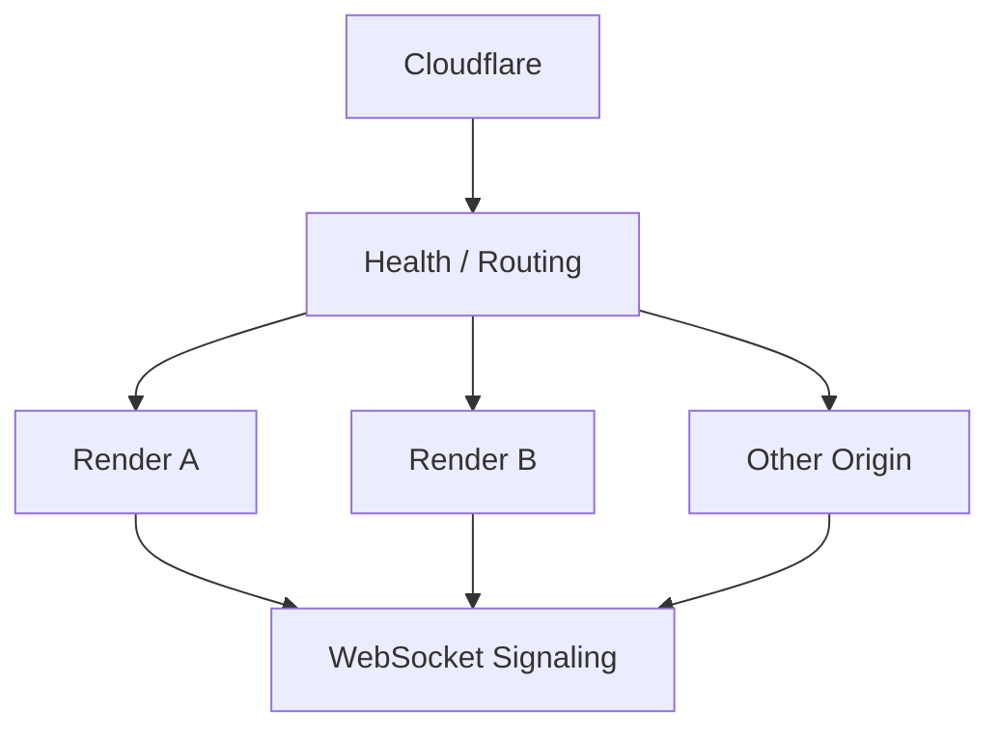

This would require careful handling of:

- WebSocket sessions;
- signaling state;
- peer discovery;
- sticky sessions if required;
- shared state if required;
- health checks;
- origin selection.

It is outside the scope of the current lightweight failover architecture.

---

## Design Principles

The ErikrafT Drop™ failover architecture follows these principles:

1. Render remains the primary service.
2. Cloudflare controls public routing.
3. The public hostname is never used as the origin target by the Worker.
4. Render has a dedicated origin hostname.
5. Vercel is an emergency fallback unless it implements compatible signaling.
6. No database is required.
7. No Codespaces dependency exists.
8. Existing WebRTC architecture is preserved.
9. Existing WebSocket architecture remains on Render.
10. Health checks use a lightweight `/health` endpoint.
11. Failover uses consecutive failures rather than a single error.
12. Recovery requires consecutive successful checks.
13. Existing sessions are not migrated automatically.
14. Existing WebRTC connections are not transparently migrated.
15. The system must fail safely instead of pretending that unavailable functionality works.

---

## Final Architecture

The recommended production architecture is:

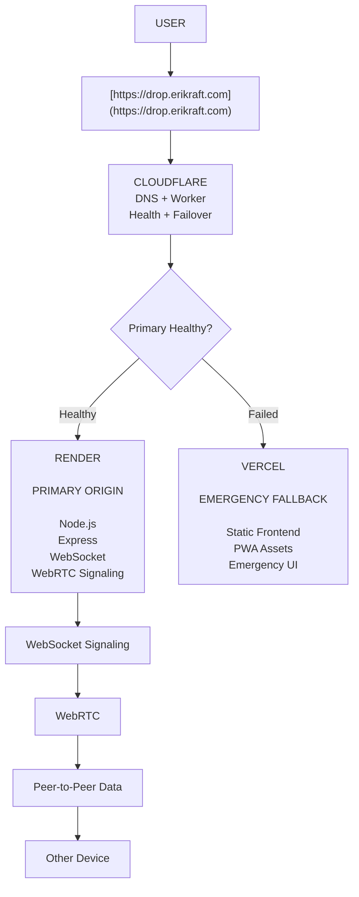

### Summary

The correct role of each component is:

| Component | Role |
| --- | --- |
| Cloudflare DNS | Public DNS and proxy |
| Cloudflare Worker | Health-aware routing and failover |
| Render | Primary ErikrafT Drop™ application |
| Vercel | Emergency frontend fallback |
| WebSocket | Primary signaling channel on Render |
| WebRTC | Peer-to-peer data transfer |
| Database | Not required |
| Redis | Not required |
| Codespaces | Not required |

The most important architectural rule is:

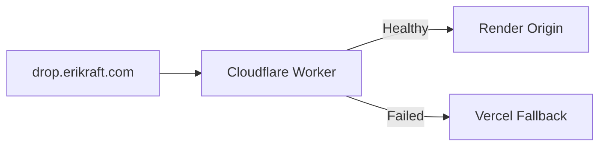

The Worker must never use `drop.erikraft.com` as the Render origin:

```mermaid
flowchart TD
    WORKER["Cloudflare Worker"]
    PUBLIC["drop.erikraft.com"]
    LOOP["Proxy Loop"]

    WORKER --> PUBLIC
    PUBLIC --> WORKER
    WORKER --> LOOP
```

This keeps the failover layer deterministic, avoids proxy loops, preserves the current Render-based ErikrafT Drop™ architecture, and allows Vercel to act as an independent emergency deployment without introducing a database or Codespaces dependency.
