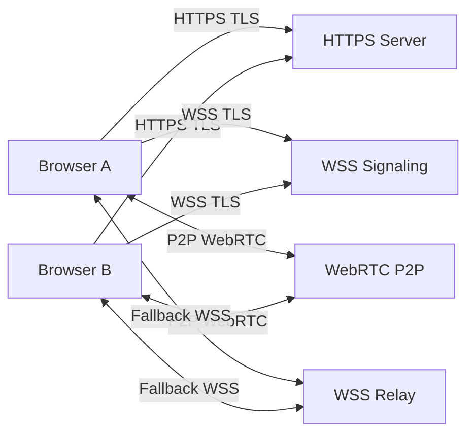

# SSL and Secure Architecture

ErikrafT Drop requires **secure connections** to operate correctly. All communication between clients and the signaling server is protected using **SSL/TLS**.

Secure transport is mandatory for modern browsers when using **WebRTC** and **Secure WebSockets (WSS)**. Without HTTPS, device discovery and file transfer may fail or be blocked entirely.

This page explains how SSL/TLS integrates into the ErikrafT Drop architecture.

---

## Why SSL is Required

ErikrafT Drop depends on secure browser APIs that only work in **secure contexts**.

SSL/TLS is required for:

- Loading the application via HTTPS
- Establishing Secure WebSocket connections (WSS)
- WebRTC signaling
- Device pairing
- Secure file transfers

Without SSL:

- Browsers block WebRTC features
- WebSocket connections may fail
- Mixed-content errors occur
- Device discovery becomes unreliable

With SSL:

- All connections are encrypted
- WebRTC works correctly
- WebSockets connect reliably
- Signaling is protected
- Transfers remain private

---

## Secure Communication Layers

ErikrafT Drop uses multiple secure layers.

### HTTPS (TLS)

HTTPS is used to:

- Load the web application
- Retrieve configuration
- Access API endpoints

Example:

```
https://drop.example.com
```

---

### Secure WebSockets (WSS)

Secure WebSockets are used for signaling between devices.

Example:

```
wss://drop.example.com/server
```

WSS is responsible for:

- Peer discovery
- Device pairing
- WebRTC signaling
- Connection management

The signaling server **does not store files**.

---

### WebRTC Encryption

WebRTC connections are always encrypted by the browser.

After signaling is complete:

- Data flows directly between peers
- Files do not pass through the server
- Encryption is end-to-end

Even when using TURN servers:

- Data remains encrypted
- Only metadata is visible to the relay

---

## Architecture Overview

Below is a **controllable architecture diagram** showing how SSL/TLS is used in ErikrafT Drop.



## Connection Flow

### Step 1 — Load Application

The browser loads ErikrafT Drop over HTTPS.

```
Browser → HTTPS Server
```

TLS encrypts:

- HTML
- CSS
- JavaScript
- Configuration data

---

### Step 2 — WebSocket Connection

The client connects to the signaling server using WSS.

```
Browser → WSS Server
```

TLS protects:

- Peer discovery
- Signaling messages
- Pairing secrets

---

### Step 3 — WebRTC Signaling

Devices exchange connection information through the signaling server.

```
Browser A → WSS → Browser B
```

TLS protects:

- SDP offers
- SDP answers
- ICE candidates

---

### Step 4 — Peer Connection

After signaling completes, a direct connection is established.

```
Browser A ↔ Browser B
```

Connection types:

- Direct P2P WebRTC
- TURN relay (if needed)

Encryption is handled automatically by WebRTC.

---

### Step 5 — File Transfer

Files are transferred directly between devices.

```
Browser A ↔ Browser B
```

Properties:

- Peer-to-peer
- Encrypted
- No server storage

---

## SSL Configuration

ErikrafT Drop supports standard TLS certificates.

Recommended options:

### Let's Encrypt

Automatic certificate generation:

```
certbot --nginx
```

Recommended for production deployments.

---

### Self-Signed Certificates

For development environments:

```
mkcert localhost
```

Useful for local testing.

---

## Required Protocols

ErikrafT Drop requires the following protocols:

| Protocol | Purpose          | Required |
| :------- | :--------------- | :------- |
| HTTPS    | Load application | Yes      |
| WSS      | Signaling        | Yes      |
| WebRTC   | P2P transfer     | Yes      |

If HTTPS or WSS is disabled, ErikrafT Drop may not function correctly.

---

## Security Notes

Important security characteristics:

- Files are never stored on the server
- Signaling data is encrypted with TLS
- File transfers use WebRTC encryption
- TURN servers cannot read file contents

---

## Best Practices

Recommended settings:

- Always enable HTTPS
- Redirect HTTP → HTTPS
- Enable HSTS
- Use strong TLS ciphers
- Keep certificates updated

Example HSTS header:

```
Strict-Transport-Security: max-age=31536000
```